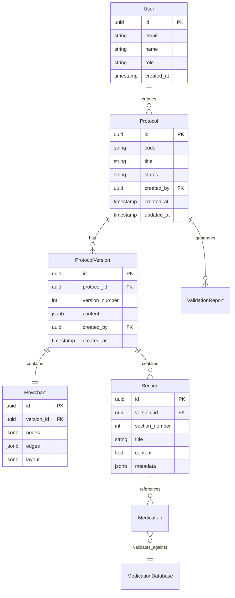

````md
Codegen Prompt  (“Implementation‑Agent”)

You are an **AI Implementation Agent** that writes code **one plan‑step at a time**.

---

## ❶ Inputs — review on every call

<project_request>

```request
# Medical Protocol Development Assistant
## Version
v0.4 – 26/5/25

## Project Description
Ferramenta web para criação assistida por IA de protocolos médicos padronizados, gerando documentação estruturada (Word/ABNT com 13 seções) e fluxogramas visuais complexos para pronto-atendimentos da rede Sancta Maggiore/Prevent Senior. IA gera protocolo completo com formato perfeito; ajustes clínicos feitos por humanos.

## Target Audience
- Primary: Criadores de protocolos (médicos coordenadores, setor de qualidade)
- Secondary: Validadores (chefes de especialidade) - via Jira existente

## Success Criteria
- Primary metric: Protocolos com 100% das seções completas e critérios objetivos definidos
- Secondary / qualitative: Tempo de criação <2 dias, consistência texto-fluxograma >95%

## Constraints
- [x] Budget ceiling: Sem restrições
- [x] Target devices / browsers: Desktop moderno, até 10 usuários simultâneos
- [x] Regulatory / compliance notes: Sem dados de pacientes
- [x] Non‑functional: PT-BR, imagens vetoriais, 20-30 protocolos/mês

## Desired Features
### AI Research & Analysis
- [x] Pesquisa via DeepResearch (fontes públicas)
    - [x] PubMed, SciELO, diretrizes abertas
    - [x] Extração de critérios diagnósticos objetivos
    - [x] Identificação de considerações geriátricas
- [x] Conversão de guidelines narrativas em lógica algorítmica
- [x] Geração de critérios binários/categóricos para decisões

### Protocol Creation - Text (Word/ABNT)
- [x] Geração automática das 13 seções obrigatórias
    - [x] Todas as seções completas e formatadas
    - [x] Critérios objetivos (sem ambiguidades)
    - [x] Dosagens específicas com vias e frequências
    - [x] Limiares numéricos para decisões
- [x] Compatibilidade total com template da qualidade
- [x] Opção de geração seção por seção para refinamento

### Protocol Creation - Visual (Flowchart)
- [x] Fluxogramas complexos formato Daktus
    - [x] Todos os caminhos do texto representados
    - [x] Tabelas de medicamentos integradas
    - [x] Condicionais com critérios explícitos
    - [x] Sem perguntas vagas ou loops infinitos
- [x] Exportação vetorial de alta qualidade
- [x] Visualização com zoom para detalhes

### Quality Assurance
- [x] Validação 100% formato vs. especificações
- [x] Cross-check completo texto ↔ fluxograma
- [x] Verificação contra CSV medicamentos
- [x] Relatório de qualquer incompletude ou ambiguidade

### Workflow Management
- [x] Modo automático: IA gera protocolo completo
- [x] Modo assistido: seção por seção se necessário
- [x] Templates dos protocolos existentes
- [x] Exportação para anexar no Jira

## Design Requests
- [x] Interface profissional PT-BR
    - [x] Editor lado a lado com sincronização
    - [x] Indicadores de completude por seção
    - [x] Alertas para critérios ambíguos
- [x] Foco em conformidade estrutural
    - [x] Checklists de validação visíveis

## Acceptance Checklist
- [x] Description final
- [x] Success criteria agreed
- [x] Constraints frozen
- [x] Feature list locked
- [x] Design requests locked

## Other Notes
- CRÍTICO: Formato perfeito é mais importante que precisão clínica inicial
- Sem seções faltantes, critérios vagos ou protocolos incompletos
- Validação e ajuste clínico feito posteriormente por especialistas
- Exemplos: bradiarritmia (17pg), ITU (fluxograma complexo c/ condicionais)

## Changelog
- v0.4: FINAL - Definido foco em formato perfeito, pesquisa via DeepResearch, todos os 3 pilares críticos
- v0.3: Adicionado volume e exemplos de protocolos
- v0.2: Simplificado escopo removendo integrações
- v0.1: Initial request structure
```
````

</project_request>

<project_rules>

`````md
# Medical Protocol Assistant - Project Rules

## Core Principles

1. **Format over Content**: Structure and formatting must be 100% correct. Clinical accuracy is secondary.
2. **Portuguese First**: All user-facing text in PT-BR. Code/comments in English.
3. **Type Safety**: Full TypeScript with strict mode. No `any` types.
4. **Validation First**: Every input must be validated before processing.

## Architecture Decisions

1. **Monorepo Structure**: Single Next.js app with clear module separation
2. **Database**: PostgreSQL for structured protocol data, S3 for document storage
3. **AI Integration**: OpenAI API with structured outputs, fallback to manual entry
4. **Document Generation**: Server-side only for consistency
5. **State Management**: Zustand for complex UI state, React Query for server state

## Code Standards

1. **Components**: Functional components only, use custom hooks for logic
2. **Styling**: Tailwind CSS only, no inline styles
3. **Naming**:
   - Components: PascalCase
   - Functions/hooks: camelCase
   - Constants: UPPER_SNAKE_CASE
   - Files: kebab-case
4. **Testing**: Required for all business logic and AI prompts

## Medical Protocol Specifics

1. **13 Sections**: Every protocol MUST have all 13 sections, even if empty
2. **Objective Criteria**: No vague terms. Numbers, thresholds, binary decisions only
3. **Medication Format**: Always include dose, route, frequency, duration
4. **Flowchart Rules**:
   - Every text decision must map to flowchart node
   - No orphan paths or infinite loops
   - Color coding: green (low risk), yellow (medium), red (high)

## Security & Compliance

1. **No PII**: System must never store patient data
2. **Audit Trail**: Log all protocol changes with timestamps
3. **Version Control**: Every protocol edit creates new version
4. **Access Control**: Role-based (creator, reviewer, admin)

## Performance Targets

1. **Protocol Generation**: < 30 seconds for AI generation
2. **Document Export**: < 5 seconds for Word/PDF
3. **Flowchart Rendering**: < 2 seconds for complex diagrams
4. **Concurrent Users**: Support 10 simultaneous editors

## Error Handling

1. **User Errors**: Clear Portuguese messages with recovery actions
2. **AI Failures**: Always provide manual fallback option
3. **Validation Errors**: Highlight specific fields/sections
4. **System Errors**: Generic message to user, detailed logs for devs

````</project_rules>

<technical_specification>
# Medical Protocol Development Assistant Technical Specification
## Version & Changelog
- v1.0 – 27/11/2024: Initial draft based on Request v0.4

## 1. System Overview
Purpose: Accelerate medical protocol creation from weeks to days while ensuring 100% format compliance with quality standards and Daktus requirements.

### User Workflow
```mermaid
graph LR
    A[Select Protocol Type] --> B[AI Research Phase]
    B --> C{Generation Mode?}
    C -->|Automatic| D[AI Generates Complete Protocol]
    C -->|Section-by-Section| E[AI Assists Each Section]
    D --> F[Review & Edit Protocol]
    E --> F
    F --> G[Cross-Validation]
    G --> H{Valid?}
    H -->|No| F
    H -->|Yes| I[Export Documents]
    I --> J[Upload to Jira]
````
`````

````

### High-Level Architecture

```mermaid
graph TB
    subgraph "Frontend - Next.js"
        A[Protocol Editor]
        B[Flowchart Visualizer]
        C[Validation Dashboard]
    end

    subgraph "API Layer - tRPC"
        D[Protocol API]
        E[AI Service]
        F[Document Generator]
    end

    subgraph "Storage"
        G[(PostgreSQL)]
        H[S3 Bucket]
        I[(Redis Cache)]
    end

    subgraph "External Services"
        J[OpenAI API]
        K[DeepResearch]
    end

    A & B & C --> D
    D --> E & F
    E --> J & K
    D --> G & H & I
```

## 2. Non-Functional Requirements

| Category        | Target                                  | Notes                                |
| --------------- | --------------------------------------- | ------------------------------------ |
| Performance     | AI generation < 30s, Export < 5s        | Streaming for better UX              |
| Uptime          | 99.9%                                   | Graceful degradation for AI services |
| Scalability     | 10 concurrent users, 30 protocols/month | Current requirement                  |
| Localization    | PT-BR interface, EN code                | Medical terms in Portuguese          |
| Accessibility   | WCAG AA compliant                       | Focus on desktop experience          |
| Browser Support | Chrome/Edge (latest 2 versions)         | Desktop only                         |

## 3. Project Structure

```
medical-protocol-assistant/
├── src/
│   ├── app/                          # Next.js App Router
│   │   ├── (auth)/
│   │   │   ├── protocols/
│   │   │   │   ├── page.tsx         # Protocol list
│   │   │   │   ├── new/page.tsx     # Create protocol
│   │   │   │   └── [id]/
│   │   │   │       ├── page.tsx     # Edit protocol
│   │   │   │       ├── preview/page.tsx
│   │   │   │       └── validate/page.tsx
│   │   │   └── dashboard/page.tsx
│   │   ├── api/
│   │   │   ├── trpc/[trpc]/route.ts
│   │   │   ├── ai/
│   │   │   │   ├── research/route.ts
│   │   │   │   └── generate/route.ts
│   │   │   └── export/
│   │   │       ├── word/route.ts
│   │   │       └── pdf/route.ts
│   │   └── layout.tsx
│   ├── components/
│   │   ├── protocol/
│   │   │   ├── editor/
│   │   │   │   ├── section-editor.tsx
│   │   │   │   └── medication-table.tsx
│   │   │   ├── flowchart/
│   │   │   │   ├── canvas.tsx
│   │   │   │   └── node-types/
│   │   │   └── validation/
│   │   │       ├── report.tsx
│   │   │       └── checklist.tsx
│   │   └── ui/                       # shadcn components
│   ├── lib/
│   │   ├── ai/
│   │   │   ├── prompts/
│   │   │   │   ├── research.ts
│   │   │   │   ├── generation.ts
│   │   │   │   └── section-specific/
│   │   │   └── clients/
│   │   │       ├── openai.ts
│   │   │       └── deep-research.ts
│   │   ├── validators/
│   │   │   ├── protocol-schema.ts    # Zod schemas
│   │   │   ├── medication.ts
│   │   │   └── flowchart.ts
│   │   └── generators/
│   │       ├── docx-generator.ts
│   │       ├── pdf-generator.ts
│   │       └── svg-generator.ts
│   ├── server/
│   │   ├── api/
│   │   │   ├── routers/
│   │   │   └── trpc.ts
│   │   └── db/
│   │       ├── schema.ts             # Drizzle ORM
│   │       └── migrations/
│   └── types/
│       ├── protocol.ts
│       ├── flowchart.ts
│       └── medication.ts
├── public/
│   ├── templates/
│   │   └── protocol-template.docx
│   └── data/
│       └── medications.csv
├── tests/
│   ├── unit/
│   ├── integration/
│   └── e2e/
└── docs/
    ├── examples/                     # Bradiarritmia, ITU examples
    └── prompts/                      # AI prompt documentation
```

**Tooling:**

- Package manager: pnpm
- Linter: ESLint with strict config
- Formatter: Prettier
- Git hooks: Husky + lint-staged
- CI: GitHub Actions

## 4. Feature Specifications

### 4.1 AI-Powered Protocol Research

**User Story:** As a protocol creator, I want AI to research medical literature so I can base protocols on current evidence.

**Flow:**

1. User selects medical condition/topic
2. System queries DeepResearch API for:
   - Recent guidelines (< 5 years)
   - Brazilian sources (CFM, MEC)
   - International guidelines
3. AI extracts:
   - Diagnostic criteria with thresholds
   - Treatment protocols with dosages
   - Special considerations for elderly
4. Results presented in structured format

**Acceptance Tests:**

- Research completes in < 30 seconds
- Sources are properly cited
- Extracts objective criteria only

### 4.2 Protocol Generation

**User Story:** As a protocol creator, I want AI to generate a complete protocol draft so I can focus on clinical validation.

**Detailed Flow:**

```typescript
// Generation modes
type GenerationMode = 'automatic' | 'section-by-section';

// Automatic mode
1. AI receives research results
2. Generates all 13 sections sequentially
3. Ensures cross-references between sections
4. Validates against format rules
5. Returns complete protocol

// Section-by-section mode
1. User selects section to generate
2. AI considers previous sections for context
3. Generates single section
4. User reviews/edits
5. Proceeds to next section
```

**Error Cases:**

- AI timeout: Show partial results, allow retry
- Invalid format: Highlight issues, provide manual editor
- Missing information: Flag as incomplete, suggest sources

### 4.3 Visual Flowchart Editor

**User Story:** As a protocol creator, I want to visualize patient flow so emergency staff can follow protocols easily.

**Components:**

```typescript
interface FlowNode {
  id: string;
  type: "decision" | "action" | "medication" | "triage";
  data: {
    title: string;
    criteria?: string; // For decisions
    actions?: string[]; // For action nodes
    medications?: Medication[]; // For medication tables
    priority?: "high" | "medium" | "low";
  };
  position: { x: number; y: number };
}

interface FlowEdge {
  id: string;
  source: string;
  target: string;
  label?: string; // Yes/No, threshold values
  type: "default" | "conditional";
}
```

**Features:**

- Drag-and-drop node creation
- Auto-layout with dagre algorithm
- Zoom/pan with minimap
- Export to SVG/PNG

### 4.4 Cross-Validation Engine

**User Story:** As a quality reviewer, I want automatic validation so protocols are consistent between text and flowchart.

**Validation Rules:**

```typescript
interface ValidationRule {
  id: string;
  type: 'structure' | 'content' | 'consistency';
  severity: 'error' | 'warning';
  check: (protocol: Protocol) => ValidationResult;
}

// Example rules:
- All 13 sections present and non-empty
- Every medication in text appears in flowchart
- All decision criteria have numeric thresholds
- No orphan nodes in flowchart
- Medication dosages match CSV database
```

**Output:**

- Color-coded report (red errors, yellow warnings)
- Click-to-navigate to issues
- Suggested fixes where possible

### 4.5 Document Export

**User Story:** As a protocol creator, I want to export to Word/PDF so I can share via Jira.

**Specifications:**

- Word: Using ABNT template, preserve all formatting
- PDF: High-quality with embedded fonts
- Flowchart: Vector SVG with zoom capability
- Batch export: All formats in single ZIP

## 5. Data Model

### 5.1 Entities & Relationships



**Database Schema (PostgreSQL):**

```sql
-- Core tables
CREATE TABLE users (
    id UUID PRIMARY KEY DEFAULT gen_random_uuid(),
    email VARCHAR(255) UNIQUE NOT NULL,
    name VARCHAR(255) NOT NULL,
    role VARCHAR(50) NOT NULL CHECK (role IN ('creator', 'reviewer', 'admin')),
    created_at TIMESTAMPTZ DEFAULT NOW()
);

CREATE TABLE protocols (
    id UUID PRIMARY KEY DEFAULT gen_random_uuid(),
    code VARCHAR(50) UNIQUE NOT NULL,
    title VARCHAR(255) NOT NULL,
    condition VARCHAR(255) NOT NULL,
    status VARCHAR(50) DEFAULT 'draft',
    created_by UUID REFERENCES users(id),
    created_at TIMESTAMPTZ DEFAULT NOW(),
    updated_at TIMESTAMPTZ DEFAULT NOW()
);

CREATE TABLE protocol_versions (
    id UUID PRIMARY KEY DEFAULT gen_random_uuid(),
    protocol_id UUID REFERENCES protocols(id) ON DELETE CASCADE,
    version_number INT NOT NULL,
    content JSONB NOT NULL,
    flowchart JSONB NOT NULL,
    created_by UUID REFERENCES users(id),
    created_at TIMESTAMPTZ DEFAULT NOW(),
    UNIQUE(protocol_id, version_number)
);

-- Indexes
CREATE INDEX idx_protocols_status ON protocols(status);
CREATE INDEX idx_protocol_versions_protocol_id ON protocol_versions(protocol_id);
CREATE INDEX idx_protocol_content_gin ON protocol_versions USING gin(content);
```

### 5.2 Data Retention & PII Handling

- **No patient data stored** - System only handles protocol templates
- User data: Retained while account active
- Protocol versions: Retained indefinitely for audit trail
- Logs: 90-day retention
- Encryption: At rest (AWS RDS encryption), in transit (TLS 1.3)

## 6. Server & Integration Layer

### API Endpoints (tRPC)

```typescript
// Protocol procedures
export const protocolRouter = router({
  // List protocols with filtering
  list: publicProcedure
    .input(
      z.object({
        status: z.enum(["draft", "review", "approved"]).optional(),
        search: z.string().optional(),
        page: z.number().default(1),
        limit: z.number().default(20),
      }),
    )
    .query(async ({ input }) => {
      // Implementation
    }),

  // Create new protocol
  create: protectedProcedure
    .input(
      z.object({
        title: z.string(),
        condition: z.string(),
        mode: z.enum(["automatic", "manual"]),
      }),
    )
    .mutation(async ({ input, ctx }) => {
      // Implementation
    }),

  // Generate with AI
  generateWithAI: protectedProcedure
    .input(
      z.object({
        protocolId: z.string().uuid(),
        researchData: ResearchResultSchema,
        sections: z.array(z.number()).optional(), // Specific sections only
      }),
    )
    .mutation(async ({ input }) => {
      // Stream AI generation updates via WebSocket
    }),

  // Validate protocol
  validate: protectedProcedure
    .input(
      z.object({
        protocolId: z.string().uuid(),
        versionId: z.string().uuid(),
      }),
    )
    .mutation(async ({ input }) => {
      // Run validation engine
    }),

  // Export protocol
  export: protectedProcedure
    .input(
      z.object({
        protocolId: z.string().uuid(),
        format: z.enum(["docx", "pdf", "svg"]),
      }),
    )
    .mutation(async ({ input }) => {
      // Generate and return S3 presigned URL
    }),
});

// AI procedures
export const aiRouter = router({
  // Research medical literature
  research: protectedProcedure
    .input(
      z.object({
        condition: z.string(),
        sources: z.array(z.enum(["pubmed", "scielo", "cfm", "mec"])),
        yearRange: z.number().default(5),
      }),
    )
    .mutation(async ({ input }) => {
      // Call DeepResearch API
    }),

  // Generate section
  generateSection: protectedProcedure
    .input(
      z.object({
        sectionNumber: z.number().min(1).max(13),
        context: ProtocolContextSchema,
        previousSections: z.record(z.string()),
      }),
    )
    .mutation(async ({ input }) => {
      // Generate specific section with OpenAI
    }),
});
```

### Background Jobs (BullMQ)

```typescript
// Job definitions
export const jobQueues = {
  documentGeneration: new Queue("document-generation"),
  aiGeneration: new Queue("ai-generation"),
  validation: new Queue("validation"),
};

// Document generation worker
new Worker(
  "document-generation",
  async (job) => {
    const { protocolId, format } = job.data;

    switch (format) {
      case "docx":
        return await generateWordDocument(protocolId);
      case "pdf":
        return await generatePdfDocument(protocolId);
      case "svg":
        return await generateSvgFlowchart(protocolId);
    }
  },
  {
    concurrency: 5,
    limiter: {
      max: 10,
      duration: 60000, // 10 per minute
    },
  },
);
```

### Third-party Integrations

```typescript
// OpenAI configuration
const openai = new OpenAI({
  apiKey: process.env.OPENAI_API_KEY,
  organization: process.env.OPENAI_ORG_ID,
});

// Structured output for protocol generation
const generateProtocol = async (research: ResearchData) => {
  const response = await openai.chat.completions.create({
    model: "gpt-4-turbo-preview",
    messages: [
      { role: "system", content: PROTOCOL_GENERATION_PROMPT },
      { role: "user", content: JSON.stringify(research) },
    ],
    response_format: { type: "json_object" },
    temperature: 0.3, // Lower for consistency
    max_tokens: 8000,
  });

  return ProtocolSchema.parse(JSON.parse(response.choices[0].message.content));
};

// S3 configuration for document storage
const s3Client = new S3Client({
  region: process.env.AWS_REGION,
  credentials: {
    accessKeyId: process.env.AWS_ACCESS_KEY_ID,
    secretAccessKey: process.env.AWS_SECRET_ACCESS_KEY,
  },
});
```

## 7. Component & Design System

### Color Palette

```typescript
// Tailwind config extension
colors: {
  primary: {
    50: '#E3F2FD',   // Light blue for backgrounds
    500: '#2196F3',  // Primary blue
    700: '#1976D2',  // Darker blue for hover
  },
  success: '#4CAF50',   // Green for low risk
  warning: '#FF9800',   // Yellow/Orange for medium risk
  danger: '#F44336',    // Red for high risk
  gray: {
    50: '#FAFAFA',   // Background
    900: '#212121',  // Text
  }
}
```

### Core UI Components

```typescript
// Protocol section editor
interface SectionEditorProps {
  sectionNumber: number;
  title: string;
  content: string;
  onChange: (content: string) => void;
  onAIAssist: () => void;
  validation: ValidationResult[];
}

// Medication table component
interface MedicationTableProps {
  medications: Medication[];
  onAdd: () => void;
  onEdit: (id: string, medication: Medication) => void;
  onDelete: (id: string) => void;
  validationErrors: Record<string, string>;
}

// Flowchart node components
interface FlowNodeProps {
  type: "decision" | "action" | "medication" | "triage";
  data: NodeData;
  selected: boolean;
  onEdit: () => void;
}

// Validation report component
interface ValidationReportProps {
  results: ValidationResult[];
  onFixIssue: (issueId: string) => void;
  onNavigateToIssue: (issueId: string) => void;
}
```

### Responsive Rules

- Desktop-first design (min-width: 1280px)
- Two-column layout for editor + flowchart
- Collapsible sidebar for navigation
- Modal overlays for complex forms

## 8. Authentication & Authorization

### NextAuth Configuration

```typescript
// auth.config.ts
export const authConfig: NextAuthConfig = {
  providers: [
    Credentials({
      credentials: {
        email: { label: "Email", type: "email" },
        password: { label: "Password", type: "password" },
      },
      authorize: async (credentials) => {
        // Validate against database
        const user = await validateUser(credentials);
        if (user) return user;
        return null;
      },
    }),
  ],
  callbacks: {
    session: ({ session, token }) => ({
      ...session,
      user: {
        ...session.user,
        id: token.sub,
        role: token.role,
      },
    }),
    jwt: ({ token, user }) => {
      if (user) {
        token.role = user.role;
      }
      return token;
    },
  },
  pages: {
    signIn: "/login",
    error: "/auth/error",
  },
};
```

### RBAC Matrix

| Role     | Create Protocol | Edit Protocol | Delete Protocol | Approve Protocol | Admin Functions |
| -------- | --------------- | ------------- | --------------- | ---------------- | --------------- |
| Creator  | ✅              | Own only      | ❌              | ❌               | ❌              |
| Reviewer | ✅              | ✅            | ❌              | ✅               | ❌              |
| Admin    | ✅              | ✅            | ✅              | ✅               | ✅              |

### Session Strategy

- JWT tokens with 8-hour expiry
- Refresh tokens for extended sessions
- HttpOnly cookies for security
- CSRF protection enabled

## 9. Payments (Stripe)

**N/A** - Internal tool with no payment processing

## 10. Observability

### Logging Configuration

```typescript
// logger.ts using Pino
export const logger = pino({
  level: process.env.LOG_LEVEL || "info",
  transport: {
    target: "pino-pretty",
    options: {
      colorize: true,
      translateTime: "UTC:yyyy-mm-dd HH:MM:ss",
      ignore: "pid,hostname",
    },
  },
  serializers: {
    error: pino.stdSerializers.err,
    request: (req) => ({
      method: req.method,
      url: req.url,
      userId: req.user?.id,
    }),
  },
});

// Usage example
logger.info(
  {
    protocolId,
    action: "generation_started",
    mode: "automatic",
  },
  "Protocol generation initiated",
);
```

### Metrics Collection

```typescript
// Custom metrics for protocol operations
export const metrics = {
  protocolGenerationDuration: new Histogram({
    name: "protocol_generation_duration_seconds",
    help: "Time taken to generate protocol with AI",
    buckets: [1, 5, 10, 30, 60, 120],
  }),

  validationErrorCount: new Counter({
    name: "protocol_validation_errors_total",
    help: "Total validation errors by type",
    labelNames: ["error_type", "severity"],
  }),

  aiApiCalls: new Counter({
    name: "ai_api_calls_total",
    help: "Total AI API calls by provider",
    labelNames: ["provider", "status"],
  }),
};
```

### Alert Thresholds

- AI generation time > 60s: Warning
- AI API failure rate > 10%: Critical
- Document export failure > 5%: Warning
- Database query time > 1s: Warning

## 11. Security & Compliance

### Threat Model Summary

1. **Prompt Injection**: Malicious input to AI
   - Mitigation: Input sanitization, prompt templates
2. **Data Exfiltration**: Unauthorized protocol access
   - Mitigation: Row-level security, audit logs
3. **DoS via AI**: Expensive AI operations
   - Mitigation: Rate limiting, job queues

### OWASP Mitigations

```typescript
// Input validation
const sanitizeInput = (input: string): string => {
  return DOMPurify.sanitize(input, {
    ALLOWED_TAGS: ["b", "i", "em", "strong", "p", "br"],
    ALLOWED_ATTR: [],
  });
};

// SQL injection prevention (using Drizzle ORM)
const getProtocol = async (id: string) => {
  return await db.query.protocols.findFirst({
    where: eq(protocols.id, id), // Parameterized query
  });
};

// Rate limiting
export const rateLimiter = new RateLimiterRedis({
  storeClient: redis,
  keyPrefix: "rl",
  points: 10, // requests
  duration: 60, // per minute
  blockDuration: 60 * 5, // 5 min block
});
```

### Secrets Management

```yaml
# Environment variables (stored in AWS Secrets Manager)
DATABASE_URL=postgresql://...
OPENAI_API_KEY=sk-...
AWS_ACCESS_KEY_ID=...
AWS_SECRET_ACCESS_KEY=...
NEXTAUTH_SECRET=...
```

### Audit Logging

```typescript
// Every state-changing action logged
export const auditLog = async (event: AuditEvent) => {
  await db.insert(auditLogs).values({
    userId: event.userId,
    action: event.action,
    resourceType: event.resourceType,
    resourceId: event.resourceId,
    metadata: event.metadata,
    timestamp: new Date(),
  });
};
```

## 12. DevOps & Deployment

### Environment Matrix

| Environment | URL                           | Database            | Purpose     |
| ----------- | ----------------------------- | ------------------- | ----------- |
| Local       | localhost:3000                | PostgreSQL (Docker) | Development |
| Staging     | staging.protocols.prevent.com | AWS RDS             | Testing     |
| Production  | protocols.prevent.com         | AWS RDS (Multi-AZ)  | Live system |

### Infrastructure as Code (Terraform)

```hcl
# AWS resources
resource "aws_rds_cluster" "protocols_db" {
  cluster_identifier = "protocols-${var.environment}"
  engine            = "aurora-postgresql"
  engine_version    = "15.4"
  database_name     = "protocols"
  master_username   = var.db_username
  master_password   = var.db_password

  backup_retention_period = 7
  preferred_backup_window = "03:00-04:00"

  enabled_cloudwatch_logs_exports = ["postgresql"]
}

resource "aws_s3_bucket" "protocol_documents" {
  bucket = "prevent-protocols-${var.environment}"

  versioning {
    enabled = true
  }

  lifecycle_rule {
    enabled = true

    transition {
      days          = 30
      storage_class = "STANDARD_IA"
    }
  }
}
```

### CI/CD Pipeline (GitHub Actions)

```yaml
name: Deploy
on:
  push:
    branches: [main]

jobs:
  test:
    runs-on: ubuntu-latest
    steps:
      - uses: actions/checkout@v3
      - uses: pnpm/action-setup@v2
      - run: pnpm install --frozen-lockfile
      - run: pnpm test
      - run: pnpm lint

  deploy:
    needs: test
    runs-on: ubuntu-latest
    steps:
      - uses: actions/checkout@v3
      - name: Deploy to AWS
        run: |
          aws ecr get-login-password | docker login --username AWS --password-stdin $ECR_URL
          docker build -t protocols .
          docker tag protocols:latest $ECR_URL/protocols:latest
          docker push $ECR_URL/protocols:latest
          aws ecs update-service --cluster protocols --service web --force-new-deployment
```

### Rollback Plan

1. Blue-green deployment with AWS ECS
2. Database migrations with rollback scripts
3. Feature flags for gradual rollout
4. Automated health checks before traffic switch

## 13. Analytics

### PostHog Configuration

```typescript
// Analytics events
export const analytics = {
  // Protocol lifecycle
  protocolCreated: (protocolId: string, mode: "manual" | "ai") => {
    posthog.capture("protocol_created", { protocolId, mode });
  },

  // AI usage
  aiGenerationStarted: (sectionNumber?: number) => {
    posthog.capture("ai_generation_started", {
      type: sectionNumber ? "section" : "full",
      sectionNumber,
    });
  },

  // Quality metrics
  validationCompleted: (errorCount: number, warningCount: number) => {
    posthog.capture("validation_completed", { errorCount, warningCount });
  },

  // User behavior
  exportFormat: (format: "docx" | "pdf" | "svg") => {
    posthog.capture("protocol_exported", { format });
  },
};
```

### Events & Properties Table

| Event                   | Properties                    | Purpose                 |
| ----------------------- | ----------------------------- | ----------------------- |
| protocol_created        | mode, condition               | Track creation patterns |
| ai_generation_completed | duration, tokens_used         | Monitor AI performance  |
| validation_failed       | error_types[]                 | Identify common issues  |
| section_edited          | section_number, edit_duration | UX optimization         |

### A/B Test Hooks

```typescript
// Feature flags for experiments
export const experiments = {
  aiModel: () => posthog.getFeatureFlag("ai_model_version"),
  generationMode: () => posthog.getFeatureFlag("default_generation_mode"),
  validationStrictness: () => posthog.getFeatureFlag("validation_level"),
};
```

## 14. Testing Strategy

### Unit Tests (Vitest)

```typescript
// Example: Protocol validator test
describe("ProtocolValidator", () => {
  it("should detect missing sections", () => {
    const protocol = createMockProtocol({ sections: 10 }); // Missing 3
    const results = validateProtocol(protocol);

    expect(results.errors).toContainEqual({
      type: "missing_section",
      sections: [11, 12, 13],
      severity: "error",
    });
  });

  it("should validate medication dosages", () => {
    const protocol = createMockProtocol({
      medications: [{ name: "Dipirona", dose: "500mg", route: "oral" }],
    });
    const results = validateMedications(protocol.medications);

    expect(results.valid).toBe(true);
  });
});
```

**Coverage Target:** 80% for business logic, 100% for validators

### Integration Tests

```typescript
// API endpoint testing
describe("Protocol API", () => {
  it("should generate protocol with AI", async () => {
    const response = await request(app)
      .post("/api/trpc/protocol.generateWithAI")
      .send({
        protocolId: "test-id",
        researchData: mockResearchData,
      })
      .expect(200);

    expect(response.body.result.data.sections).toHaveLength(13);
  });
});
```

### E2E Tests (Playwright)

```typescript
// Critical user journey
test("Complete protocol creation flow", async ({ page }) => {
  await page.goto("/protocols/new");

  // Select condition
  await page.selectOption("#condition", "bradycardia");

  // Choose AI generation
  await page.click('button:has-text("Generate with AI")');

  // Wait for generation
  await page.waitForSelector(".generation-complete", { timeout: 60000 });

  // Validate
  await page.click('button:has-text("Validate")');
  await expect(page.locator(".validation-success")).toBeVisible();

  // Export
  await page.click('button:has-text("Export Word")');
  const download = await page.waitForEvent("download");
  expect(download.suggestedFilename()).toContain(".docx");
});
```

### Load Testing

```javascript
// k6 script
import http from "k6/http";
import { check } from "k6";

export const options = {
  stages: [
    { duration: "2m", target: 10 }, // Ramp up to 10 users
    { duration: "5m", target: 10 }, // Stay at 10 users
    { duration: "2m", target: 0 }, // Ramp down
  ],
};

export default function () {
  const res = http.post("https://protocols.prevent.com/api/ai/generate", {
    condition: "test_condition",
  });

  check(res, {
    "status is 200": (r) => r.status === 200,
    "generation time < 30s": (r) => r.timings.duration < 30000,
  });
}
```

## 15. Open Questions & Risks

### 🚧 AI Accuracy & Hallucinations

- **Risk:** AI generates medically incorrect information
- **Mitigation:**
  - Strict prompt engineering with examples
  - Mandatory human review workflow
  - Confidence scoring for AI suggestions

### 🚧 Integration with Prevent Senior Systems

- **Risk:** Unknown authentication requirements
- **Mitigation:**
  - Build with SAML/OAuth capability
  - Modular auth system for easy swapping

### 🚧 Flowchart Complexity Limits

- **Risk:** Some protocols too complex for visual representation
- **Mitigation:**
  - Hierarchical flowcharts with sub-processes
  - Alternative table view for complex logic

### 🚧 User Training & Adoption

- **Risk:** Medical staff resistant to new tools
- **Mitigation:**
  - Comprehensive PT-BR documentation
  - Video tutorials
  - Pilot program with feedback loop

### 🚧 DeepResearch API Availability

- **Risk:** Service downtime affects protocol creation
- **Mitigation:**
  - Cache common research queries
  - Manual research input option
  - Multiple research source fallbacks</technical_specification>

<implementation_plan>
{{# Implementation Plan

## Project Foundation

- [x] **Step 1 – Initialize Next.js Project Structure** (Effort: S, Risk: Low, Rollback: Safe)

  - **Task**: Create Next.js 14 project with TypeScript, configure folder structure, install core dependencies.
  - **Files**:
    - `package.json`: Next.js 14, TypeScript, core dependencies
    - `tsconfig.json`: strict TypeScript configuration
    - `tailwind.config.js`: custom color palette and design tokens
    - `next.config.js`: basic configuration
    - `src/app/layout.tsx`: root layout with providers
    - `src/app/page.tsx`: landing page placeholder
  - **Step Dependencies**: none
  - **User Instructions**: Run `pnpm create next-app medical-protocol-assistant --typescript --tailwind --app`

- [x] **Step 2 – Setup Development Environment** (Effort: S, Risk: Low, Rollback: Safe)
  - **Task**: Configure ESLint, Prettier, Husky, and development tooling.
  - **Files**:
    - `.eslintrc.json`: strict ESLint rules for TypeScript
    - `.prettierrc`: code formatting rules
    - `.husky/pre-commit`: lint-staged configuration
    - `.env.example`: environment variables template
    - `README.md`: project setup instructions
  - **Step Dependencies**: Step 1
  - **User Instructions**: Copy `.env.example` to `.env.local` and fill in placeholder values

## Database & Schema Setup

- [x] **Step 3 – Configure Database Schema** (Effort: M, Risk: Med, Rollback: Reversible)

  - **Task**: Setup Prisma with PostgreSQL schema for protocols, users, versions, and audit logging.
  - **Files**:
    - `prisma/schema.prisma`: complete database schema with all entities
    - `prisma/migrations/`: initial migration files
    - `src/lib/db/client.ts`: Prisma client configuration
    - `src/lib/db/seed.ts`: seed data for development
  - **Step Dependencies**: Step 1
  - **User Instructions**: Setup PostgreSQL locally with Docker: `docker run --name postgres -e POSTGRES_PASSWORD=password -p 5432:5432 -d postgres:15`
  - **Rollback**: Drop database and re-run migrations if schema changes needed

- [x] **Step 4 – Database Connection & Types** (Effort: S, Risk: Low, Rollback: Safe)
  - **Task**: Generate Prisma types and setup database connection utilities.
  - **Files**:
    - `src/types/database.ts`: generated Prisma types exports
    - `src/lib/db/queries.ts`: common database query helpers
    - `src/lib/db/constants.ts`: database constants and enums
  - **Step Dependencies**: Step 3
  - **User Instructions**: Run `npx prisma generate` and `npx prisma db push`

## Authentication & Authorization

- [x] **Step 5 – NextAuth Configuration** (Effort: M, Risk: Med, Rollback: Reversible)

  - **Task**: Setup NextAuth with credentials provider and session management.
  - **Files**:
    - `src/lib/auth/config.ts`: NextAuth configuration with credentials
    - `src/lib/auth/providers.ts`: authentication providers setup
    - `src/lib/auth/actions.ts`: placeholder user validation actions
    - `src/app/api/auth/[...nextauth]/route.ts`: NextAuth API route
    - `src/middleware.ts`: auth middleware for protected routes
    - `src/types/auth.ts`: authentication type definitions
    - `src/app/login/page.tsx`: custom login page
    - `src/app/auth/error/page.tsx`: custom auth error page
  - **Step Dependencies**: Step 4
  - **User Instructions**: Generate NEXTAUTH_SECRET with `openssl rand -base64 32` and add to .env.local. Ensure `NEXTAUTH_URL` is set.

- [x] **Step 6 – Role-Based Access Control** (Effort: M, Risk: Low, Rollback: Safe)
  - **Task**: Implement RBAC system with creator/reviewer/admin roles.
  - **Files**:
    - `src/lib/auth/rbac.ts`: role validation and permission checking
    - `src/lib/auth/permissions.ts`: permission constants and matrices
    - `src/hooks/use-auth.ts`: authentication React hook
    - `src/components/auth/protected-route.tsx`: route protection component
  - **Step Dependencies**: Step 5
  - **User Instructions**: none

## Core API Layer

- [x] **Step 7 – tRPC Server Setup** (Effort: M, Risk: Low, Rollback: Safe)

  - **Task**: Configure tRPC with context, middleware, and basic router structure.
  - **Files**:
    - `src/server/api/trpc.ts`: tRPC server configuration
    - `src/server/api/context.ts`: request context with auth and db
    - `src/server/api/root.ts`: root router combining all routers
    - `src/app/api/trpc/[trpc]/route.ts`: tRPC API route handler
    - `src/lib/api/client.ts`: tRPC client configuration
  - **Step Dependencies**: Step 6
  - **User Instructions**: none

- [x] **Step 8 – Protocol API Router** (Effort: M, Risk: Low, Rollback: Safe)
  - **Task**: Create tRPC router for protocol CRUD operations with validation.
  - **Files**:
    - `src/server/api/routers/protocol.ts`: protocol management endpoints
    - `src/lib/validators/protocol.ts`: Zod schemas for protocol validation
    - `src/server/api/routers/user.ts`: user management endpoints
    - `src/types/protocol.ts`: TypeScript types for protocols
  - **Step Dependencies**: Step 7
  - **User Instructions**: none

## AI Integration Foundation

- [x] **Step 9 – OpenAI Client Setup** (Effort: S, Risk: Med, Rollback: Safe)

  - **Task**: Configure OpenAI client with structured output and error handling.
  - **Files**:
    - `src/lib/ai/client.ts`: OpenAI client configuration
    - `src/lib/ai/types.ts`: AI request/response types
    - `src/lib/ai/errors.ts`: AI-specific error handling
    - `src/lib/ai/config.ts`: AI model configuration and limits
  - **Step Dependencies**: Step 1
  - **User Instructions**: Obtain OpenAI API key and add to environment variables

- [x] **Step 10 – Medical Research Integration** (Effort: L, Risk: High, Rollback: Safe)
  - **Task**: Implement DeepResearch API integration for medical literature search.
  - **Files**:
    - `src/lib/ai/research.ts`: research API client and data extraction
    - `src/lib/ai/prompts/research.ts`: research prompt templates
    - `src/server/api/routers/research.ts`: research endpoints
    - `src/types/research.ts`: research data types
    - `src/lib/ai/research.test.ts`: research functionality tests
  - **Step Dependencies**: Step 9
  - **User Instructions**: Configure DeepResearch API credentials if available, otherwise implement mock responses

# Updated Implementation Plan (excerpt)
## Protocol Generation Engine
- [x] **Step 11 – AI Protocol Generation** (Effort: L, Risk: High, Rollback: Safe)

  - **Task**: Create AI-powered protocol generation with all 13 sections and structured output.
  - **Files**:
    - `src/lib/ai/generator.ts`: main protocol generation logic
    - `src/lib/ai/prompts/section-specific/index.ts`: Index for section-specific prompts, defines `SECTION_DEFINITIONS`
    - `src/lib/ai/prompts/section-specific/section-1-metadata.ts`: Example prompt details for section 1 (placeholder for now)
    - `src/lib/ai/prompts/section-specific/section-common.ts`: Common helper strings for section prompts
    - `src/lib/ai/prompts/protocol-generation.ts`: Overall medical protocol generation prompts (system and user prompt creation functions)
    - `src/lib/validators/generated-content.ts`: Zod schemas for validating AI-generated medical content structure
    - `src/server/api/routers/generation.ts`: generation API endpoints
    - `src/lib/ai/generator.test.ts`: Unit/integration tests for the generation logic.
    - `src/types/ai-generation.ts`: Specific types for AI generation request/response.
  - **Step Dependencies**: Step 10
  - **User Instructions**: none

- [x] **Step 12 – Protocol Validation Engine** (Effort: L, Risk: Med, Rollback: Safe)
  - **Task**: Build comprehensive validation system for protocol structure and content consistency.
  - **Files**:
    - `src/lib/validators/protocol-structure.ts`: structural validation rules
    - `src/lib/validators/medication.ts`: medication validation against CSV
    - `src/lib/validators/cross-validation.ts`: text-flowchart consistency checks
    - `src/lib/validators/completeness.ts`: completeness validation rules
    - `public/data/medications.csv`: medication database
  - **Step Dependencies**: Step 11
  - **User Instructions**: Upload medication CSV file to public/data/ folder

# Updated Implementation Plan (excerpt)
## Document Generation System
- [x] **Step 13 – Word Document Generation (with Supabase Storage)** (Effort: L, Risk: Med, Rollback: Safe)
  - **Task**: Implement DOCX generation with ABNT formatting and template compliance. Store documents in Supabase Storage.
  - **Files**:
    - `src/lib/generators/docx.ts`: Word document generation with docx library.
    - `src/lib/generators/templates.ts`: ABNT template configuration.
    - `public/templates/protocol-template.docx`: base Word template.
    - `src/lib/supabase/client.ts`: Supabase client configuration.
    - `src/lib/supabase/storageActions.ts`: Supabase Storage upload and signed URL functions.
    - `src/server/api/routers/export.ts`: Document export tRPC endpoints using Supabase Storage.
    - `package.json`: Add `@supabase/supabase-js`, remove AWS SDK.
    - `.env.example`: Add Supabase environment variables.
  - **Step Dependencies**: Step 8 (Protocol API Router for fetching protocol data)
  - **User Instructions**: Add ABNT-compliant Word template to `public/templates/`. Configure Supabase URL, Service Role Key, and Storage Bucket Name in `.env.local`. Create the bucket in your Supabase project. Ensure style IDs in `templates.ts` match those in your Word template.

- [x] **Step 14 – PDF and SVG Export** (Effort: M, Risk: Low, Rollback: Safe)
  - **Task**: Add PDF export and SVG flowchart generation capabilities.
  - **Files**:
    - `src/lib/generators/pdf.ts`: PDF generation using react-pdf
    - `src/lib/generators/svg.ts`: SVG flowchart export
    - `src/lib/generators/utils.ts`: shared generation utilities
  - **Step Dependencies**: Step 13
  - **User Instructions**: none

# Updated Implementation Plan (excerpt)
## Flowchart System
- [x] **Step 15 – ReactFlow Integration** (Effort: L, Risk: Med, Rollback: Safe)

  - **Task**: Setup ReactFlow for visual flowchart editing with custom nodes and medical-specific components.
  - **Files**:
    - `src/components/protocol/flowchart/protocol-flowchart-canvas.tsx`
    - `src/components/protocol/flowchart/node-types/index.ts`
    - `src/components/protocol/flowchart/node-types/decision-node.tsx`
    - `src/components/protocol/flowchart/node-types/action-node.tsx`
    - `src/components/protocol/flowchart/node-types/medication-node.tsx`
    - `src/components/protocol/flowchart/node-types/triage-node.tsx`
    - `src/components/protocol/flowchart/ui/minimap.tsx`
    - `src/components/protocol/flowchart/ui/controls.tsx`
    - `src/types/flowchart.ts`
    - `package.json` (add `reactflow`)
  - **Step Dependencies**: Step 8 (implied, for data integration later), general frontend setup.
  - **User Instructions**: Install `reactflow`. Ensure `cn` utility and Tailwind custom colors are available.

- [x] **Step 16 – Flowchart Auto-Generation** (Effort: L, Risk: High, Rollback: Safe)
  - **Task**: Generate flowcharts automatically from protocol text using AI and layout algorithms.
  - **Files**:
    - `src/lib/flowchart/generator.ts`: text-to-flowchart conversion
    - `src/lib/flowchart/layout.ts`: automatic layout using dagre
    - `src/lib/ai/prompts/flowchart.ts`: flowchart generation prompts
    - `src/lib/flowchart/validation.ts`: flowchart consistency validation
  - **Step Dependencies**: Step 15
  - **User Instructions**: none

# Updated Implementation Plan (excerpt)
## Frontend Components
- [x] **Step 17 – UI Component Library** (Effort: M, Risk: Low, Rollback: Safe)

  - **Task**: Setup shadcn/ui components and custom medical protocol UI components.
  - **Files**:
    - `src/components/ui/button.tsx` (Example shadcn component)
    - `src/components/ui/input.tsx` (Example shadcn component)
    - `src/components/ui/dialog.tsx` (Example shadcn component)
    - `src/components/layout/main-layout.tsx`
    - `src/components/layout/sidebar.tsx`
    - `src/components/layout/header.tsx`
    - `src/components/protocol/protocol-section-display.tsx`
    - `src/components/protocol/medication-table-display.tsx`
    - `src/lib/utils.ts` (Ensure `cn` utility)
    - `src/app/(auth)/layout.tsx` (New layout for authenticated routes)
    - `src/app/(auth)/dashboard/page.tsx` (Placeholder page for layout demo)
    - `package.json` (Ensure shadcn/ui related dependencies)
  - **Step Dependencies**: Step 5 (Auth setup for header/sidebar user info)
  - **User Instructions**: Run `pnpm dlx shadcn-ui@latest init` and `pnpm dlx shadcn-ui@latest add button input dialog`. Install `lucide-react`.

- [x] **Step 18 – Protocol Editor Interface** (Effort: L, Risk: Med, Rollback: Safe)
  - **Task**: Build main protocol editing interface with side-by-side text and flowchart views.
  - **Files**:
    - `src/app/(auth)/protocols/[id]/page.tsx`
    - `src/components/protocol/editor/protocol-editor-layout.tsx`
    - `src/components/protocol/editor/text-editor-pane.tsx`
    - `src/components/protocol/editor/flowchart-pane.tsx`
    - `src/components/protocol/editor/section-navigation-list.tsx`
    - `src/components/protocol/editor/validation-report-display.tsx`
    - `src/hooks/use-protocol-editor-state.ts`
    - `src/app/(auth)/protocols/page.tsx` (placeholder for navigation)
    - `src/app/(auth)/protocols/new/page.tsx` (placeholder for navigation)
    - `src/components/ui/scroll-area.tsx` (placeholder for shadcn component)
  - **Step Dependencies**: Step 17 (UI components), Step 15 (Flowchart canvas), Step 8 (Protocol API for data - mocked for now)
  - **User Instructions**: Add `scroll-area` shadcn/ui component: `pnpm dlx shadcn-ui@latest add scroll-area`.

- [x] **Step 19 – Dashboard and Protocol Management** (Effort: M, Risk: Low, Rollback: Safe)
  - **Task**: Create dashboard, protocol list, and management interfaces.
  - **Files**:
    - `src/app/(auth)/dashboard/page.tsx`: main dashboard (enhance placeholder)
    - `src/app/(auth)/protocols/page.tsx`: protocol list with filtering (implement fully)
    - `src/app/(auth)/protocols/new/page.tsx`: new protocol creation form (implement fully)
    - `src/components/protocol/list/protocol-card.tsx`: protocol list item component
    - `src/components/dashboard/stats-cards.tsx`: (new) dashboard statistics display cards
    - `src/components/protocol/forms/create-protocol-form.tsx`: (new) Form for new protocol page
  - **Step Dependencies**: Step 18 (uses layouts and some shared components), Step 8 (Protocol API for listing/creating)
  - **User Instructions**: none

## Quality Assurance & Testing

- [x] **Step 20 – Testing Infrastructure** (Effort: M, Risk: Low, Rollback: Safe)

  - **Task**: Setup testing framework with unit, integration, and E2E tests.
  - **Files**:
    - `vitest.config.ts`: Vitest configuration for unit tests
    - `playwright.config.ts`: Playwright E2E test configuration
    - `tests/setup.ts`: test environment setup
    - `tests/unit/validators.test.ts`: validation logic tests
    - `tests/integration/api.test.ts`: API endpoint tests
  - **Step Dependencies**: Step 8
  - **User Instructions**: none

- [x] **Step 21 – AI Prompt Testing** (Effort: M, Risk: Med, Rollback: Safe)
  - **Task**: Create comprehensive tests for AI prompts and generation quality.
  - **Files**:
    - `tests/unit/ai/prompts.test.ts`: prompt template tests
    - `tests/integration/ai/generation.test.ts`: AI generation quality tests
    - `tests/fixtures/protocols.ts`: test protocol examples
    - `src/lib/ai/evaluation.ts`: AI output evaluation metrics
  - **Step Dependencies**: Step 20
  - **User Instructions**: Set test OpenAI API key with lower rate limits

## CI/CD & Quality Gates

- [x] **Step 22 – GitHub Actions CI** (Effort: S, Risk: Low, Rollback: Safe)

  - **Task**: Setup continuous integration with linting, testing, and build verification.
  - **Files**:
    - `.github/workflows/ci.yml`: CI pipeline with test, lint, build steps
    - `.github/workflows/test.yml`: comprehensive test suite
    - `.github/dependabot.yml`: automated dependency updates
  - **Step Dependencies**: Step 21
  - **User Instructions**: Add repository secrets for `OPENAI_API_KEY`, `DATABASE_URL`, `NEXTAUTH_SECRET`

- [x] **Step 23 – Code Quality Enforcement** (Effort: S, Risk: Low, Rollback: Safe)
  - **Task**: Add code coverage reporting and quality gates.
  - **Files**:
    - `.github/workflows/coverage.yml`: coverage reporting workflow
    - `vitest.config.ts`: coverage configuration
    - `.github/workflows/security.yml`: security scanning
  - **Step Dependencies**: Step 22
  - **User Instructions**: Configure branch protection rules requiring CI checks

# Updated Implementation Plan (excerpt)
## Infrastructure & Deployment
- [x] **Step 24 – Cloud Infrastructure Setup (Revised for No AWS Cost)** (Effort: M, Risk: Low, Rollback: N/A as no resources created)
  - **Task**: Create a minimal and safe Terraform placeholder directory. `main.tf` will explicitly define no AWS resources. `README.md` will document that primary hosting is via Vercel/Supabase and this Terraform setup is for potential, optional supplementary services, respecting the "no AWS cost" preference.
  - **Files**:
    - `infra/terraform/main.tf` (Content: comments, no active resources)
    - `infra/terraform/README.md` (Detailed explanation of placeholder status and no-cost intent)
    - `infra/terraform/.gitignore` (Standard)
  - **Step Dependencies**: Step 22
  - **User Instructions**: Understand the placeholder nature of this setup. No AWS resources will be created or costs incurred by default. `terraform init` is safe; `terraform apply` should only be used if resources are intentionally added.
  - **Rollback**: N/A as no cloud resources are provisioned by default with this setup.

- [x] **Step 25 – Production Deployment (to Vercel)** (Effort: L, Risk: Med, Rollback: Vercel rollback features)
  - **Task**: Configure Next.js application for deployment to Vercel. Setup Vercel project and GitHub integration for CI/CD. Ensure local development environment is consistent using Docker.
  - **Files**:
    - `vercel.json` (Vercel project configurations, build commands)
    - `Dockerfile` (For local dev consistency / alternative containerized deployments)
    - `docker-compose.yml` (Local development stack with app and PostgreSQL database)
    - `.github/workflows/deploy-vercel.yml` (GitHub Actions workflow for Vercel deployment)
    - `README.md` (Updated with Vercel deployment and local Docker instructions)
  - **Step Dependencies**: Conceptually follows infrastructure setup (Step 24), but main dependency is a working application.
  - **User Instructions**: Create Vercel account & project, link GitHub repo, configure Vercel environment variables, add `VERCEL_TOKEN`, `VERCEL_ORG_ID`, `VERCEL_PROJECT_ID` as GitHub secrets. Review Docker setup for local development.
  - **Rollback**: Revert to a previous deployment on Vercel dashboard.

## Final Integration & Documentation

- [ ] **Step 26 – Documentation & Examples** (Effort: M, Risk: Low, Rollback: Safe)
  - **Task**: Create comprehensive documentation with protocol examples and user guides.
  - **Files**:
    - `docs/user-guide.md`: Portuguese user documentation
    - `docs/api/README.md`: API documentation
    - `docs/examples/bradycardia-protocol.md`: example protocol documentation
    - `docs/examples/itu-protocol.md`: complex flowchart example
    - `docs/deployment.md`: deployment and maintenance guide
  - **Step Dependencies**: Step 25
  - **User Instructions**: Review documentation for accuracy and completeness}}
    </implementation_plan>

<existing_code>
{{YOUR_CODE}}
</existing_code>

---

## ❷ Think first – private reasoning

Enclose all internal thoughts in **`<codegen_planning>`** tags.
Decide:

1. The **next unchecked step** in the Implementation Plan.
2. Whether that step needs **plan edits** (if yes, update the plan at the end).
3. How to satisfy file‑count ≤ 20 and spec constraints.
4. Edge‑cases, tests, and lint fixes you must include.

End **`</codegen_planning>`** before emitting files; content inside the tags is hidden from the user.

---

## ❸ Output format (strict)

For **every file you create or modify**, supply **full contents** using the template below—one file after another.

````

Here's what I did and why: <concise rationale for this file>
Filepath: path/to/file.ext

```<language>
<ENTIRE FILE CONTENTS>
```

```

**Rules**

- No ellipses; no partial snippets.
- Include imports, types, comments, tests—*everything*.
- Write **file‑level JSDoc/Docstring** + inline comments for complex logic.
- Follow project lint & format standards; assume `npm run lint && npm test` must succeed.
- Never hard‑code secrets; reference `process.env.*` and document required variables in User Instructions.
- Keep bundle growth reasonable; if a dependency balloons size, explain mitigation.

---

## ❹ Step completion footer

After all files:

```

STEP <N> COMPLETE

**Summary**

- <one‑sentence what was implemented>

**Commit Message**
<type(scope): subject — Conventional Commits format>

**Changed Files**

- path/to/one.ts
- path/to/two.test.ts
  …

**USER INSTRUCTIONS**

1. <command to install deps / run migration / add env vars>
2. …

````

If you **updated the Implementation Plan**, append the **modified steps only** inside a fenced markdown block:

```md
# Updated Implementation Plan (excerpt)
## [Track / Milestone]
- [ ] Step X – …
````

---

## ❺ Guardrails

- ≤ 20 files per step; ≤ 800 LOC total.
- Touch only the files listed in the current plan‑step unless you also update the plan.
- If a step is **irreversible** (e.g., DB migration), prepend a `/** ROLLBACK NOTES */` comment in the migration file.
- If there are **no unchecked steps**, output  
  `ALL STEPS COMPLETE – nothing to do.` and stop.

---

Work sequentially, stay within scope, and keep the codebase always in a releasable state.

```

```
