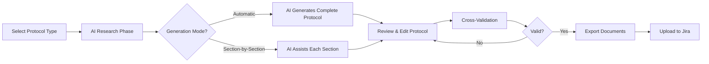
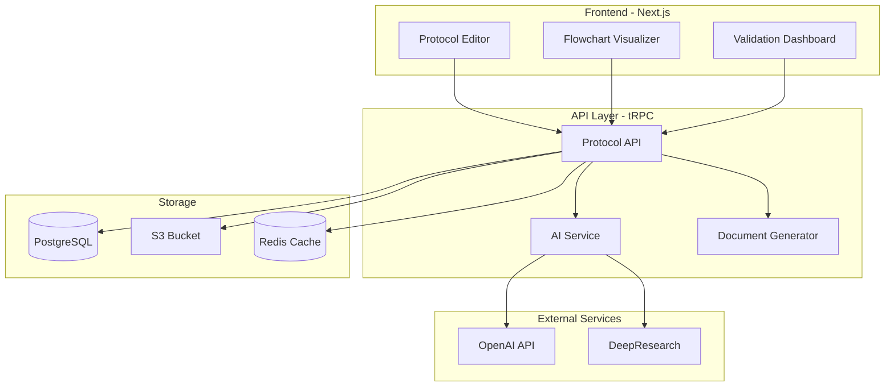
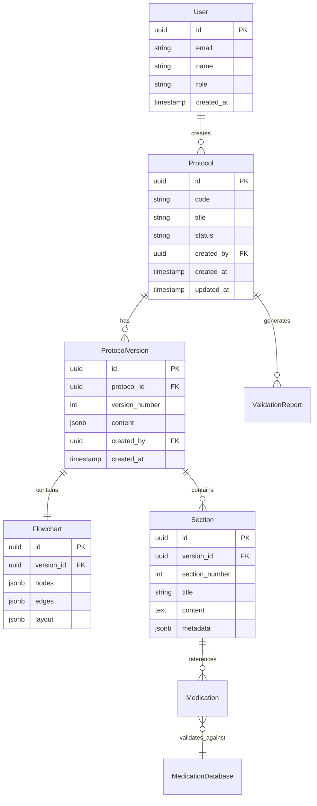

# Medical Protocol Development Assistant Technical Specification

## Version & Changelog

- v1.0 – 27/11/2024: Initial draft based on Request v0.4

## 1. System Overview

Purpose: Accelerate medical protocol creation from weeks to days while ensuring 100% format compliance with quality standards and Daktus requirements.

### User Workflow



### High-Level Architecture



## 2. Non-Functional Requirements

| Category        | Target                                  | Notes                                |
| --------------- | --------------------------------------- | ------------------------------------ |
| Performance     | AI generation < 30s, Export < 5s        | Streaming for better UX              |
| Uptime          | 99.9%                                   | Graceful degradation for AI services |
| Scalability     | 10 concurrent users, 30 protocols/month | Current requirement                  |
| Localization    | PT-BR interface, EN code                | Medical terms in Portuguese          |
| Accessibility   | WCAG AA compliant                       | Focus on desktop experience          |
| Browser Support | Chrome/Edge (latest 2 versions)         | Desktop only                         |

## 3. Project Structure

```
medical-protocol-assistant/
├── src/
│   ├── app/                          # Next.js App Router
│   │   ├── (auth)/
│   │   │   ├── protocols/
│   │   │   │   ├── page.tsx         # Protocol list
│   │   │   │   ├── new/page.tsx     # Create protocol
│   │   │   │   └── [id]/
│   │   │   │       ├── page.tsx     # Edit protocol
│   │   │   │       ├── preview/page.tsx
│   │   │   │       └── validate/page.tsx
│   │   │   └── dashboard/page.tsx
│   │   ├── api/
│   │   │   ├── trpc/[trpc]/route.ts
│   │   │   ├── ai/
│   │   │   │   ├── research/route.ts
│   │   │   │   └── generate/route.ts
│   │   │   └── export/
│   │   │       ├── word/route.ts
│   │   │       └── pdf/route.ts
│   │   └── layout.tsx
│   ├── components/
│   │   ├── protocol/
│   │   │   ├── editor/
│   │   │   │   ├── section-editor.tsx
│   │   │   │   └── medication-table.tsx
│   │   │   ├── flowchart/
│   │   │   │   ├── canvas.tsx
│   │   │   │   └── node-types/
│   │   │   └── validation/
│   │   │       ├── report.tsx
│   │   │       └── checklist.tsx
│   │   └── ui/                       # shadcn components
│   ├── lib/
│   │   ├── ai/
│   │   │   ├── prompts/
│   │   │   │   ├── research.ts
│   │   │   │   ├── generation.ts
│   │   │   │   └── section-specific/
│   │   │   └── clients/
│   │   │       ├── openai.ts
│   │   │       └── deep-research.ts
│   │   ├── validators/
│   │   │   ├── protocol-schema.ts    # Zod schemas
│   │   │   ├── medication.ts
│   │   │   └── flowchart.ts
│   │   └── generators/
│   │       ├── docx-generator.ts
│   │       ├── pdf-generator.ts
│   │       └── svg-generator.ts
│   ├── server/
│   │   ├── api/
│   │   │   ├── routers/
│   │   │   └── trpc.ts
│   │   └── db/
│   │       ├── schema.ts             # Drizzle ORM
│   │       └── migrations/
│   └── types/
│       ├── protocol.ts
│       ├── flowchart.ts
│       └── medication.ts
├── public/
│   ├── templates/
│   │   └── protocol-template.docx
│   └── data/
│       └── medications.csv
├── tests/
│   ├── unit/
│   ├── integration/
│   └── e2e/
└── docs/
    ├── examples/                     # Bradiarritmia, ITU examples
    └── prompts/                      # AI prompt documentation
```

**Tooling:**

- Package manager: pnpm
- Linter: ESLint with strict config
- Formatter: Prettier
- Git hooks: Husky + lint-staged
- CI: GitHub Actions

## 4. Feature Specifications

### 4.1 AI-Powered Protocol Research

**User Story:** As a protocol creator, I want AI to research medical literature so I can base protocols on current evidence.

**Flow:**

1. User selects medical condition/topic
2. System queries DeepResearch API for:
   - Recent guidelines (< 5 years)
   - Brazilian sources (CFM, MEC)
   - International guidelines
3. AI extracts:
   - Diagnostic criteria with thresholds
   - Treatment protocols with dosages
   - Special considerations for elderly
4. Results presented in structured format

**Acceptance Tests:**

- Research completes in < 30 seconds
- Sources are properly cited
- Extracts objective criteria only

### 4.2 Protocol Generation

**User Story:** As a protocol creator, I want AI to generate a complete protocol draft so I can focus on clinical validation.

**Detailed Flow:**

```typescript
// Generation modes
type GenerationMode = 'automatic' | 'section-by-section';

// Automatic mode
1. AI receives research results
2. Generates all 13 sections sequentially
3. Ensures cross-references between sections
4. Validates against format rules
5. Returns complete protocol

// Section-by-section mode
1. User selects section to generate
2. AI considers previous sections for context
3. Generates single section
4. User reviews/edits
5. Proceeds to next section
```

**Error Cases:**

- AI timeout: Show partial results, allow retry
- Invalid format: Highlight issues, provide manual editor
- Missing information: Flag as incomplete, suggest sources

### 4.3 Visual Flowchart Editor

**User Story:** As a protocol creator, I want to visualize patient flow so emergency staff can follow protocols easily.

**Components:**

```typescript
interface FlowNode {
  id: string;
  type: "decision" | "action" | "medication" | "triage";
  data: {
    title: string;
    criteria?: string; // For decisions
    actions?: string[]; // For action nodes
    medications?: Medication[]; // For medication tables
    priority?: "high" | "medium" | "low";
  };
  position: { x: number; y: number };
}

interface FlowEdge {
  id: string;
  source: string;
  target: string;
  label?: string; // Yes/No, threshold values
  type: "default" | "conditional";
}
```

**Features:**

- Drag-and-drop node creation
- Auto-layout with dagre algorithm
- Zoom/pan with minimap
- Export to SVG/PNG

### 4.4 Cross-Validation Engine

**User Story:** As a quality reviewer, I want automatic validation so protocols are consistent between text and flowchart.

**Validation Rules:**

```typescript
interface ValidationRule {
  id: string;
  type: 'structure' | 'content' | 'consistency';
  severity: 'error' | 'warning';
  check: (protocol: Protocol) => ValidationResult;
}

// Example rules:
- All 13 sections present and non-empty
- Every medication in text appears in flowchart
- All decision criteria have numeric thresholds
- No orphan nodes in flowchart
- Medication dosages match CSV database
```

**Output:**

- Color-coded report (red errors, yellow warnings)
- Click-to-navigate to issues
- Suggested fixes where possible

### 4.5 Document Export

**User Story:** As a protocol creator, I want to export to Word/PDF so I can share via Jira.

**Specifications:**

- Word: Using ABNT template, preserve all formatting
- PDF: High-quality with embedded fonts
- Flowchart: Vector SVG with zoom capability
- Batch export: All formats in single ZIP

## 5. Data Model

### 5.1 Entities & Relationships



**Database Schema (PostgreSQL):**

```sql
-- Core tables
CREATE TABLE users (
    id UUID PRIMARY KEY DEFAULT gen_random_uuid(),
    email VARCHAR(255) UNIQUE NOT NULL,
    name VARCHAR(255) NOT NULL,
    role VARCHAR(50) NOT NULL CHECK (role IN ('creator', 'reviewer', 'admin')),
    created_at TIMESTAMPTZ DEFAULT NOW()
);

CREATE TABLE protocols (
    id UUID PRIMARY KEY DEFAULT gen_random_uuid(),
    code VARCHAR(50) UNIQUE NOT NULL,
    title VARCHAR(255) NOT NULL,
    condition VARCHAR(255) NOT NULL,
    status VARCHAR(50) DEFAULT 'draft',
    created_by UUID REFERENCES users(id),
    created_at TIMESTAMPTZ DEFAULT NOW(),
    updated_at TIMESTAMPTZ DEFAULT NOW()
);

CREATE TABLE protocol_versions (
    id UUID PRIMARY KEY DEFAULT gen_random_uuid(),
    protocol_id UUID REFERENCES protocols(id) ON DELETE CASCADE,
    version_number INT NOT NULL,
    content JSONB NOT NULL,
    flowchart JSONB NOT NULL,
    created_by UUID REFERENCES users(id),
    created_at TIMESTAMPTZ DEFAULT NOW(),
    UNIQUE(protocol_id, version_number)
);

-- Indexes
CREATE INDEX idx_protocols_status ON protocols(status);
CREATE INDEX idx_protocol_versions_protocol_id ON protocol_versions(protocol_id);
CREATE INDEX idx_protocol_content_gin ON protocol_versions USING gin(content);
```

### 5.2 Data Retention & PII Handling

- **No patient data stored** - System only handles protocol templates
- User data: Retained while account active
- Protocol versions: Retained indefinitely for audit trail
- Logs: 90-day retention
- Encryption: At rest (AWS RDS encryption), in transit (TLS 1.3)

## 6. Server & Integration Layer

### API Endpoints (tRPC)

```typescript
// Protocol procedures
export const protocolRouter = router({
  // List protocols with filtering
  list: publicProcedure
    .input(
      z.object({
        status: z.enum(["draft", "review", "approved"]).optional(),
        search: z.string().optional(),
        page: z.number().default(1),
        limit: z.number().default(20),
      }),
    )
    .query(async ({ input }) => {
      // Implementation
    }),

  // Create new protocol
  create: protectedProcedure
    .input(
      z.object({
        title: z.string(),
        condition: z.string(),
        mode: z.enum(["automatic", "manual"]),
      }),
    )
    .mutation(async ({ input, ctx }) => {
      // Implementation
    }),

  // Generate with AI
  generateWithAI: protectedProcedure
    .input(
      z.object({
        protocolId: z.string().uuid(),
        researchData: ResearchResultSchema,
        sections: z.array(z.number()).optional(), // Specific sections only
      }),
    )
    .mutation(async ({ input }) => {
      // Stream AI generation updates via WebSocket
    }),

  // Validate protocol
  validate: protectedProcedure
    .input(
      z.object({
        protocolId: z.string().uuid(),
        versionId: z.string().uuid(),
      }),
    )
    .mutation(async ({ input }) => {
      // Run validation engine
    }),

  // Export protocol
  export: protectedProcedure
    .input(
      z.object({
        protocolId: z.string().uuid(),
        format: z.enum(["docx", "pdf", "svg"]),
      }),
    )
    .mutation(async ({ input }) => {
      // Generate and return S3 presigned URL
    }),
});

// AI procedures
export const aiRouter = router({
  // Research medical literature
  research: protectedProcedure
    .input(
      z.object({
        condition: z.string(),
        sources: z.array(z.enum(["pubmed", "scielo", "cfm", "mec"])),
        yearRange: z.number().default(5),
      }),
    )
    .mutation(async ({ input }) => {
      // Call DeepResearch API
    }),

  // Generate section
  generateSection: protectedProcedure
    .input(
      z.object({
        sectionNumber: z.number().min(1).max(13),
        context: ProtocolContextSchema,
        previousSections: z.record(z.string()),
      }),
    )
    .mutation(async ({ input }) => {
      // Generate specific section with OpenAI
    }),
});
```

### Background Jobs (BullMQ)

```typescript
// Job definitions
export const jobQueues = {
  documentGeneration: new Queue("document-generation"),
  aiGeneration: new Queue("ai-generation"),
  validation: new Queue("validation"),
};

// Document generation worker
new Worker(
  "document-generation",
  async (job) => {
    const { protocolId, format } = job.data;

    switch (format) {
      case "docx":
        return await generateWordDocument(protocolId);
      case "pdf":
        return await generatePdfDocument(protocolId);
      case "svg":
        return await generateSvgFlowchart(protocolId);
    }
  },
  {
    concurrency: 5,
    limiter: {
      max: 10,
      duration: 60000, // 10 per minute
    },
  },
);
```

### Third-party Integrations

```typescript
// OpenAI configuration
const openai = new OpenAI({
  apiKey: process.env.OPENAI_API_KEY,
  organization: process.env.OPENAI_ORG_ID,
});

// Structured output for protocol generation
const generateProtocol = async (research: ResearchData) => {
  const response = await openai.chat.completions.create({
    model: "gpt-4-turbo-preview",
    messages: [
      { role: "system", content: PROTOCOL_GENERATION_PROMPT },
      { role: "user", content: JSON.stringify(research) },
    ],
    response_format: { type: "json_object" },
    temperature: 0.3, // Lower for consistency
    max_tokens: 8000,
  });

  return ProtocolSchema.parse(JSON.parse(response.choices[0].message.content));
};

// S3 configuration for document storage
const s3Client = new S3Client({
  region: process.env.AWS_REGION,
  credentials: {
    accessKeyId: process.env.AWS_ACCESS_KEY_ID,
    secretAccessKey: process.env.AWS_SECRET_ACCESS_KEY,
  },
});
```

## 7. Component & Design System

### Color Palette

```typescript
// Tailwind config extension
colors: {
  primary: {
    50: '#E3F2FD',   // Light blue for backgrounds
    500: '#2196F3',  // Primary blue
    700: '#1976D2',  // Darker blue for hover
  },
  success: '#4CAF50',   // Green for low risk
  warning: '#FF9800',   // Yellow/Orange for medium risk
  danger: '#F44336',    // Red for high risk
  gray: {
    50: '#FAFAFA',   // Background
    900: '#212121',  // Text
  }
}
```

### Core UI Components

```typescript
// Protocol section editor
interface SectionEditorProps {
  sectionNumber: number;
  title: string;
  content: string;
  onChange: (content: string) => void;
  onAIAssist: () => void;
  validation: ValidationResult[];
}

// Medication table component
interface MedicationTableProps {
  medications: Medication[];
  onAdd: () => void;
  onEdit: (id: string, medication: Medication) => void;
  onDelete: (id: string) => void;
  validationErrors: Record<string, string>;
}

// Flowchart node components
interface FlowNodeProps {
  type: "decision" | "action" | "medication" | "triage";
  data: NodeData;
  selected: boolean;
  onEdit: () => void;
}

// Validation report component
interface ValidationReportProps {
  results: ValidationResult[];
  onFixIssue: (issueId: string) => void;
  onNavigateToIssue: (issueId: string) => void;
}
```

### Responsive Rules

- Desktop-first design (min-width: 1280px)
- Two-column layout for editor + flowchart
- Collapsible sidebar for navigation
- Modal overlays for complex forms

## 8. Authentication & Authorization

### NextAuth Configuration

```typescript
// auth.config.ts
export const authConfig: NextAuthConfig = {
  providers: [
    Credentials({
      credentials: {
        email: { label: "Email", type: "email" },
        password: { label: "Password", type: "password" },
      },
      authorize: async (credentials) => {
        // Validate against database
        const user = await validateUser(credentials);
        if (user) return user;
        return null;
      },
    }),
  ],
  callbacks: {
    session: ({ session, token }) => ({
      ...session,
      user: {
        ...session.user,
        id: token.sub,
        role: token.role,
      },
    }),
    jwt: ({ token, user }) => {
      if (user) {
        token.role = user.role;
      }
      return token;
    },
  },
  pages: {
    signIn: "/login",
    error: "/auth/error",
  },
};
```

### RBAC Matrix

| Role     | Create Protocol | Edit Protocol | Delete Protocol | Approve Protocol | Admin Functions |
| -------- | --------------- | ------------- | --------------- | ---------------- | --------------- |
| Creator  | ✅              | Own only      | ❌              | ❌               | ❌              |
| Reviewer | ✅              | ✅            | ❌              | ✅               | ❌              |
| Admin    | ✅              | ✅            | ✅              | ✅               | ✅              |

### Session Strategy

- JWT tokens with 8-hour expiry
- Refresh tokens for extended sessions
- HttpOnly cookies for security
- CSRF protection enabled

## 9. Payments (Stripe)

**N/A** - Internal tool with no payment processing

## 10. Observability

### Logging Configuration

```typescript
// logger.ts using Pino
export const logger = pino({
  level: process.env.LOG_LEVEL || "info",
  transport: {
    target: "pino-pretty",
    options: {
      colorize: true,
      translateTime: "UTC:yyyy-mm-dd HH:MM:ss",
      ignore: "pid,hostname",
    },
  },
  serializers: {
    error: pino.stdSerializers.err,
    request: (req) => ({
      method: req.method,
      url: req.url,
      userId: req.user?.id,
    }),
  },
});

// Usage example
logger.info(
  {
    protocolId,
    action: "generation_started",
    mode: "automatic",
  },
  "Protocol generation initiated",
);
```

### Metrics Collection

```typescript
// Custom metrics for protocol operations
export const metrics = {
  protocolGenerationDuration: new Histogram({
    name: "protocol_generation_duration_seconds",
    help: "Time taken to generate protocol with AI",
    buckets: [1, 5, 10, 30, 60, 120],
  }),

  validationErrorCount: new Counter({
    name: "protocol_validation_errors_total",
    help: "Total validation errors by type",
    labelNames: ["error_type", "severity"],
  }),

  aiApiCalls: new Counter({
    name: "ai_api_calls_total",
    help: "Total AI API calls by provider",
    labelNames: ["provider", "status"],
  }),
};
```

### Alert Thresholds

- AI generation time > 60s: Warning
- AI API failure rate > 10%: Critical
- Document export failure > 5%: Warning
- Database query time > 1s: Warning

## 11. Security & Compliance

### Threat Model Summary

1. **Prompt Injection**: Malicious input to AI
   - Mitigation: Input sanitization, prompt templates
2. **Data Exfiltration**: Unauthorized protocol access
   - Mitigation: Row-level security, audit logs
3. **DoS via AI**: Expensive AI operations
   - Mitigation: Rate limiting, job queues

### OWASP Mitigations

```typescript
// Input validation
const sanitizeInput = (input: string): string => {
  return DOMPurify.sanitize(input, {
    ALLOWED_TAGS: ["b", "i", "em", "strong", "p", "br"],
    ALLOWED_ATTR: [],
  });
};

// SQL injection prevention (using Drizzle ORM)
const getProtocol = async (id: string) => {
  return await db.query.protocols.findFirst({
    where: eq(protocols.id, id), // Parameterized query
  });
};

// Rate limiting
export const rateLimiter = new RateLimiterRedis({
  storeClient: redis,
  keyPrefix: "rl",
  points: 10, // requests
  duration: 60, // per minute
  blockDuration: 60 * 5, // 5 min block
});
```

### Secrets Management

```yaml
# Environment variables (stored in AWS Secrets Manager)
DATABASE_URL=postgresql://...
OPENAI_API_KEY=sk-...
AWS_ACCESS_KEY_ID=...
AWS_SECRET_ACCESS_KEY=...
NEXTAUTH_SECRET=...
```

### Audit Logging

```typescript
// Every state-changing action logged
export const auditLog = async (event: AuditEvent) => {
  await db.insert(auditLogs).values({
    userId: event.userId,
    action: event.action,
    resourceType: event.resourceType,
    resourceId: event.resourceId,
    metadata: event.metadata,
    timestamp: new Date(),
  });
};
```

## 12. DevOps & Deployment

### Environment Matrix

| Environment | URL                           | Database            | Purpose     |
| ----------- | ----------------------------- | ------------------- | ----------- |
| Local       | localhost:3000                | PostgreSQL (Docker) | Development |
| Staging     | staging.protocols.prevent.com | AWS RDS             | Testing     |
| Production  | protocols.prevent.com         | AWS RDS (Multi-AZ)  | Live system |

### Infrastructure as Code (Terraform)

```hcl
# AWS resources
resource "aws_rds_cluster" "protocols_db" {
  cluster_identifier = "protocols-${var.environment}"
  engine            = "aurora-postgresql"
  engine_version    = "15.4"
  database_name     = "protocols"
  master_username   = var.db_username
  master_password   = var.db_password

  backup_retention_period = 7
  preferred_backup_window = "03:00-04:00"

  enabled_cloudwatch_logs_exports = ["postgresql"]
}

resource "aws_s3_bucket" "protocol_documents" {
  bucket = "prevent-protocols-${var.environment}"

  versioning {
    enabled = true
  }

  lifecycle_rule {
    enabled = true

    transition {
      days          = 30
      storage_class = "STANDARD_IA"
    }
  }
}
```

### CI/CD Pipeline (GitHub Actions)

```yaml
name: Deploy
on:
  push:
    branches: [main]

jobs:
  test:
    runs-on: ubuntu-latest
    steps:
      - uses: actions/checkout@v3
      - uses: pnpm/action-setup@v2
      - run: pnpm install --frozen-lockfile
      - run: pnpm test
      - run: pnpm lint

  deploy:
    needs: test
    runs-on: ubuntu-latest
    steps:
      - uses: actions/checkout@v3
      - name: Deploy to AWS
        run: |
          aws ecr get-login-password | docker login --username AWS --password-stdin $ECR_URL
          docker build -t protocols .
          docker tag protocols:latest $ECR_URL/protocols:latest
          docker push $ECR_URL/protocols:latest
          aws ecs update-service --cluster protocols --service web --force-new-deployment
```

### Rollback Plan

1. Blue-green deployment with AWS ECS
2. Database migrations with rollback scripts
3. Feature flags for gradual rollout
4. Automated health checks before traffic switch

## 13. Analytics

### PostHog Configuration

```typescript
// Analytics events
export const analytics = {
  // Protocol lifecycle
  protocolCreated: (protocolId: string, mode: "manual" | "ai") => {
    posthog.capture("protocol_created", { protocolId, mode });
  },

  // AI usage
  aiGenerationStarted: (sectionNumber?: number) => {
    posthog.capture("ai_generation_started", {
      type: sectionNumber ? "section" : "full",
      sectionNumber,
    });
  },

  // Quality metrics
  validationCompleted: (errorCount: number, warningCount: number) => {
    posthog.capture("validation_completed", { errorCount, warningCount });
  },

  // User behavior
  exportFormat: (format: "docx" | "pdf" | "svg") => {
    posthog.capture("protocol_exported", { format });
  },
};
```

### Events & Properties Table

| Event                   | Properties                    | Purpose                 |
| ----------------------- | ----------------------------- | ----------------------- |
| protocol_created        | mode, condition               | Track creation patterns |
| ai_generation_completed | duration, tokens_used         | Monitor AI performance  |
| validation_failed       | error_types[]                 | Identify common issues  |
| section_edited          | section_number, edit_duration | UX optimization         |

### A/B Test Hooks

```typescript
// Feature flags for experiments
export const experiments = {
  aiModel: () => posthog.getFeatureFlag("ai_model_version"),
  generationMode: () => posthog.getFeatureFlag("default_generation_mode"),
  validationStrictness: () => posthog.getFeatureFlag("validation_level"),
};
```

## 14. Testing Strategy

### Unit Tests (Vitest)

```typescript
// Example: Protocol validator test
describe("ProtocolValidator", () => {
  it("should detect missing sections", () => {
    const protocol = createMockProtocol({ sections: 10 }); // Missing 3
    const results = validateProtocol(protocol);

    expect(results.errors).toContainEqual({
      type: "missing_section",
      sections: [11, 12, 13],
      severity: "error",
    });
  });

  it("should validate medication dosages", () => {
    const protocol = createMockProtocol({
      medications: [{ name: "Dipirona", dose: "500mg", route: "oral" }],
    });
    const results = validateMedications(protocol.medications);

    expect(results.valid).toBe(true);
  });
});
```

**Coverage Target:** 80% for business logic, 100% for validators

### Integration Tests

```typescript
// API endpoint testing
describe("Protocol API", () => {
  it("should generate protocol with AI", async () => {
    const response = await request(app)
      .post("/api/trpc/protocol.generateWithAI")
      .send({
        protocolId: "test-id",
        researchData: mockResearchData,
      })
      .expect(200);

    expect(response.body.result.data.sections).toHaveLength(13);
  });
});
```

### E2E Tests (Playwright)

```typescript
// Critical user journey
test("Complete protocol creation flow", async ({ page }) => {
  await page.goto("/protocols/new");

  // Select condition
  await page.selectOption("#condition", "bradycardia");

  // Choose AI generation
  await page.click('button:has-text("Generate with AI")');

  // Wait for generation
  await page.waitForSelector(".generation-complete", { timeout: 60000 });

  // Validate
  await page.click('button:has-text("Validate")');
  await expect(page.locator(".validation-success")).toBeVisible();

  // Export
  await page.click('button:has-text("Export Word")');
  const download = await page.waitForEvent("download");
  expect(download.suggestedFilename()).toContain(".docx");
});
```

### Load Testing

```javascript
// k6 script
import http from "k6/http";
import { check } from "k6";

export const options = {
  stages: [
    { duration: "2m", target: 10 }, // Ramp up to 10 users
    { duration: "5m", target: 10 }, // Stay at 10 users
    { duration: "2m", target: 0 }, // Ramp down
  ],
};

export default function () {
  const res = http.post("https://protocols.prevent.com/api/ai/generate", {
    condition: "test_condition",
  });

  check(res, {
    "status is 200": (r) => r.status === 200,
    "generation time < 30s": (r) => r.timings.duration < 30000,
  });
}
```

## 15. Open Questions & Risks

### 🚧 AI Accuracy & Hallucinations

- **Risk:** AI generates medically incorrect information
- **Mitigation:**
  - Strict prompt engineering with examples
  - Mandatory human review workflow
  - Confidence scoring for AI suggestions

### 🚧 Integration with Prevent Senior Systems

- **Risk:** Unknown authentication requirements
- **Mitigation:**
  - Build with SAML/OAuth capability
  - Modular auth system for easy swapping

### 🚧 Flowchart Complexity Limits

- **Risk:** Some protocols too complex for visual representation
- **Mitigation:**
  - Hierarchical flowcharts with sub-processes
  - Alternative table view for complex logic

### 🚧 User Training & Adoption

- **Risk:** Medical staff resistant to new tools
- **Mitigation:**
  - Comprehensive PT-BR documentation
  - Video tutorials
  - Pilot program with feedback loop

### 🚧 DeepResearch API Availability

- **Risk:** Service downtime affects protocol creation
- **Mitigation:**
  - Cache common research queries
  - Manual research input option
  - Multiple research source fallbacks
