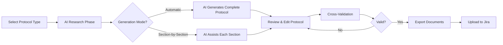
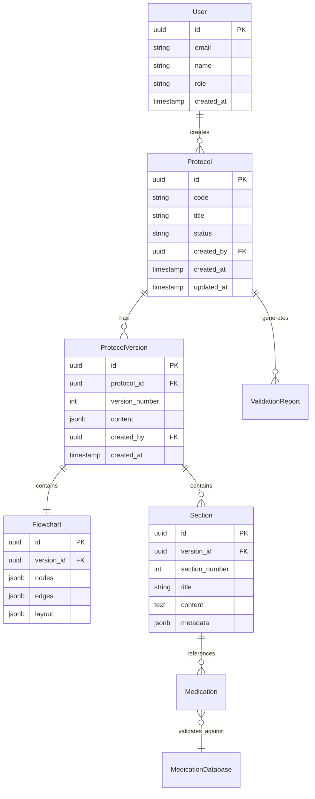

Okay, I will now update the `technical_specification.md` based on Step 1 of the Optimization Plan. This involves aligning the document with the Vercel/Supabase stack, removing or re-contextualizing AWS-specific details, and preparing it for subsequent optimization steps.

Here is the **updated content for `technical_specification.md`**:

````md
# Medical Protocol Development Assistant Technical Specification

## Version & Changelog

- v1.1 – 28/05/2025: Aligned with Vercel/Supabase stack (Optimization Plan Step 1).
- v1.0 – 27/11/2024: Initial draft based on Request v0.4

## 1. System Overview

Purpose: Accelerate medical protocol creation from weeks to days while ensuring 100% format compliance with quality standards and Daktus requirements.

### User Workflow


````

### High-Level Architecture

```mermaid
graph TB
    subgraph "Frontend - Next.js (Vercel)"
        A[Protocol Editor]
        B[Flowchart Visualizer]
        C[Validation Dashboard]
    end

    subgraph "API Layer - tRPC (Vercel Functions)"
        D[Protocol API]
        E[AI Service]
        F[Document Generator]
    end

    subgraph "Storage & Database"
        G[(Supabase DB - PostgreSQL)]
        H[(Supabase Storage)]
        %% I[(Redis Cache - Provider TBD for Vercel)] %% Temporarily removed, to be addressed in Step 3
    end

    subgraph "External Services"
        J[OpenAI API]
        K[DeepResearch]
    end

    A & B & C --> D
    D --> E & F
    E --> J & K
    D --> G & H %% & I
```

**Note:** Redis for caching and background job queue management is under review for a Vercel-compatible solution (e.g., Upstash) and will be detailed in a subsequent update.

## 2. Non-Functional Requirements

| Category        | Target                                  | Notes                                            |
| --------------- | --------------------------------------- | ------------------------------------------------ |
| Performance     | AI generation < 30s, Export < 5s        | Streaming for better UX; Vercel function limits  |
| Uptime          | 99.9%                                   | Graceful degradation for AI services; Vercel SLA |
| Scalability     | 10 concurrent users, 30 protocols/month | Current requirement; Vercel auto-scaling         |
| Localization    | PT-BR interface, EN code                | Medical terms in Portuguese                      |
| Accessibility   | WCAG AA compliant                       | Focus on desktop experience                      |
| Browser Support | Chrome/Edge (latest 2 versions)         | Desktop only                                     |

## 3. Project Structure

```
medical-protocol-assistant/
├── src/
│   ├── app/                          # Next.js App Router (Vercel)
│   │   ├── (auth)/
│   │   │   ├── protocols/
│   │   │   │   ├── page.tsx         # Protocol list
│   │   │   │   ├── new/page.tsx     # Create protocol
│   │   │   │   └── [id]/
│   │   │   │       ├── page.tsx     # Edit protocol
│   │   │   │       ├── preview/page.tsx
│   │   │   │       └── validate/page.tsx
│   │   │   └── dashboard/page.tsx
│   │   ├── api/
│   │   │   ├── trpc/[trpc]/route.ts # Vercel Serverless Functions
│   │   │   ├── ai/
│   │   │   │   ├── research/route.ts
│   │   │   │   └── generate/route.ts
│   │   │   └── export/
│   │   │       ├── word/route.ts
│   │   │       └── pdf/route.ts
│   │   └── layout.tsx
│   ├── components/
│   │   ├── protocol/
│   │   │   ├── editor/
│   │   │   │   ├── section-editor.tsx
│   │   │   │   └── medication-table.tsx
│   │   │   ├── flowchart/
│   │   │   │   ├── canvas.tsx
│   │   │   │   └── node-types/
│   │   │   └── validation/
│   │   │       ├── report.tsx
│   │   │       └── checklist.tsx
│   │   └── ui/                       # shadcn components
│   ├── lib/
│   │   ├── ai/
│   │   │   ├── prompts/
│   │   │   │   ├── research.ts
│   │   │   │   ├── generation.ts
│   │   │   │   └── section-specific/
│   │   │   └── clients/
│   │   │       ├── openai.ts
│   │   │       └── deep-research.ts
│   │   ├── validators/
│   │   │   ├── protocol-schema.ts    # Zod schemas
│   │   │   ├── medication.ts
│   │   │   └── flowchart.ts
│   │   └── generators/
│   │       ├── docx-generator.ts
│   │       ├── pdf-generator.ts
│   │       └── svg-generator.ts
│   │   └── supabase/                 # Supabase client and actions
│   │       ├── client.ts
│   │       └── storageActions.ts
│   ├── server/
│   │   ├── api/
│   │   │   ├── routers/
│   │   │   └── trpc.ts
│   │   └── db/
│   │       ├── schema.ts             # Prisma ORM (preferred over Drizzle comment)
│   │       └── migrations/
│   └── types/
│       ├── protocol.ts
│       ├── flowchart.ts
│       └── medication.ts
├── public/
│   ├── templates/
│   │   └── protocol-template.docx
│   └── data/
│       └── medications.csv          # Accessed by serverless functions
├── tests/
│   ├── unit/
│   ├── integration/
│   └── e2e/
├── docs/
│   ├── examples/                     # Bradiarritmia, ITU examples
│   └── prompts/                      # AI prompt documentation
├── infra/
│   └── terraform/                    # Terraform for optional supplementary services (not primary infra)
│       ├── main.tf
│       └── README.md
└── prisma/                           # Prisma schema and migrations
    └── schema.prisma
```

**Tooling:**

- Package manager: pnpm
- Linter: ESLint with strict config
- Formatter: Prettier
- Git hooks: Husky + lint-staged
- CI: GitHub Actions (deploying to Vercel)

## 4. Feature Specifications

### 4.1 AI-Powered Protocol Research

(No changes in this section for Step 1)

### 4.2 Protocol Generation

(No changes in this section for Step 1)

### 4.3 Visual Flowchart Editor

(No changes in this section for Step 1)

### 4.4 Cross-Validation Engine

(No changes in this section for Step 1)

### 4.5 Document Export

**User Story:** As a protocol creator, I want to export to Word/PDF so I can share via Jira.

**Specifications:**

- Word: Using ABNT template, preserve all formatting
- PDF: High-quality with embedded fonts
- Flowchart: Vector SVG with zoom capability
- Batch export: All formats in single ZIP
- Storage: Documents temporarily generated and then uploaded to Supabase Storage, with pre-signed URLs provided for download.

## 5. Data Model

### 5.1 Entities & Relationships



**Database Schema (PostgreSQL - Hosted on Supabase):**

```sql
-- Core tables (managed by Prisma ORM)
CREATE TABLE users (
    id UUID PRIMARY KEY DEFAULT gen_random_uuid(),
    email VARCHAR(255) UNIQUE NOT NULL,
    name VARCHAR(255) NOT NULL,
    role VARCHAR(50) NOT NULL CHECK (role IN ('creator', 'reviewer', 'admin')),
    created_at TIMESTAMPTZ DEFAULT NOW()
);

CREATE TABLE protocols (
    id UUID PRIMARY KEY DEFAULT gen_random_uuid(),
    code VARCHAR(50) UNIQUE NOT NULL,
    title VARCHAR(255) NOT NULL,
    condition VARCHAR(255) NOT NULL,
    status VARCHAR(50) DEFAULT 'draft',
    created_by UUID REFERENCES users(id),
    created_at TIMESTAMPTZ DEFAULT NOW(),
    updated_at TIMESTAMPTZ DEFAULT NOW()
);

CREATE TABLE protocol_versions (
    id UUID PRIMARY KEY DEFAULT gen_random_uuid(),
    protocol_id UUID REFERENCES protocols(id) ON DELETE CASCADE,
    version_number INT NOT NULL,
    content JSONB NOT NULL,
    flowchart JSONB NOT NULL,
    created_by UUID REFERENCES users(id),
    created_at TIMESTAMPTZ DEFAULT NOW(),
    UNIQUE(protocol_id, version_number)
);

-- Indexes
CREATE INDEX idx_protocols_status ON protocols(status);
CREATE INDEX idx_protocol_versions_protocol_id ON protocol_versions(protocol_id);
CREATE INDEX idx_protocol_content_gin ON protocol_versions USING gin(content);
```

### 5.2 Data Retention & PII Handling

- **No patient data stored** - System only handles protocol templates
- User data: Retained while account active
- Protocol versions: Retained indefinitely for audit trail
- Logs: 90-day retention (via Vercel logging or custom solution)
- Encryption: At rest (Supabase encryption), in transit (TLS 1.3)

## 6. Server & Integration Layer

### API Endpoints (tRPC)

```typescript
// Protocol procedures
export const protocolRouter = router({
  // List protocols with filtering
  list: publicProcedure
    .input(
      z.object({
        status: z.enum(["draft", "review", "approved"]).optional(),
        search: z.string().optional(),
        page: z.number().default(1),
        limit: z.number().default(20),
      }),
    )
    .query(async ({ input }) => {
      // Implementation
    }),

  // Create new protocol
  create: protectedProcedure
    .input(
      z.object({
        title: z.string(),
        condition: z.string(),
        mode: z.enum(["automatic", "manual"]),
      }),
    )
    .mutation(async ({ input, ctx }) => {
      // Implementation
    }),

  // Generate with AI
  generateWithAI: protectedProcedure
    .input(
      z.object({
        protocolId: z.string().uuid(),
        researchData: ResearchResultSchema,
        sections: z.array(z.number()).optional(), // Specific sections only
      }),
    )
    .mutation(async ({ input }) => {
      // Stream AI generation updates via WebSocket or long-polling
    }),

  // Validate protocol
  validate: protectedProcedure
    .input(
      z.object({
        protocolId: z.string().uuid(),
        versionId: z.string().uuid(),
      }),
    )
    .mutation(async ({ input }) => {
      // Run validation engine
    }),

  // Export protocol
  export: protectedProcedure
    .input(
      z.object({
        protocolId: z.string().uuid(),
        format: z.enum(["docx", "pdf", "svg"]),
      }),
    )
    .mutation(async ({ input }) => {
      // Generate and return Supabase Storage presigned URL
    }),
});

// AI procedures
export const aiRouter = router({
  // Research medical literature
  research: protectedProcedure
    .input(
      z.object({
        condition: z.string(),
        sources: z.array(z.enum(["pubmed", "scielo", "cfm", "mec"])),
        yearRange: z.number().default(5),
      }),
    )
    .mutation(async ({ input }) => {
      // Call DeepResearch API
    }),

  // Generate section
  generateSection: protectedProcedure
    .input(
      z.object({
        sectionNumber: z.number().min(1).max(13),
        context: ProtocolContextSchema,
        previousSections: z.record(z.string()),
      }),
    )
    .mutation(async ({ input }) => {
      // Generate specific section with OpenAI
    }),
});
```

### Background Jobs (BullMQ or Vercel Cron/Background Functions)

```typescript
// Job definitions (if using BullMQ with external Redis)
// export const jobQueues = {
//   documentGeneration: new Queue("document-generation"),
//   aiGeneration: new Queue("ai-generation"),
//   validation: new Queue("validation"),
// };

// // Document generation worker (example if using BullMQ)
// new Worker(
//   "document-generation",
//   async (job) => {
//     const { protocolId, format } = job.data;
//     // ... generation logic ...
//   },
//   { /* ... concurrency, limiter ... */ }
// );
```

**Note:** For Vercel, long-running tasks might leverage Vercel Background Functions or Vercel Cron Jobs calling dedicated API endpoints. The choice between BullMQ (requiring an external Redis like Upstash) and Vercel-native solutions is under review.

### Third-party Integrations

```typescript
// OpenAI configuration
const openai = new OpenAI({
  apiKey: process.env.OPENAI_API_KEY,
  organization: process.env.OPENAI_ORG_ID,
});

// Structured output for protocol generation
const generateProtocol = async (research: ResearchData) => {
  const response = await openai.chat.completions.create({
    model: "gpt-4-turbo-preview",
    messages: [
      { role: "system", content: PROTOCOL_GENERATION_PROMPT },
      { role: "user", content: JSON.stringify(research) },
    ],
    response_format: { type: "json_object" },
    temperature: 0.3, // Lower for consistency
    max_tokens: 8000,
  });

  return ProtocolSchema.parse(JSON.parse(response.choices[0].message.content));
};

// Supabase configuration for document storage
// (Client initialized in `src/lib/supabase/client.ts`)
// import { supabase } from '@/lib/supabase/client'; // Example import
// async function uploadDocumentToSupabase(file: File, path: string) {
//   const { data, error } = await supabase.storage.from('protocol-documents').upload(path, file);
//   if (error) throw error;
//   return data;
// }
// async function getDocumentUrl(path: string) {
//   const { data } = supabase.storage.from('protocol-documents').getPublicUrl(path);
//   return data.publicUrl;
// }
```

**Note:** Supabase client and storage interaction logic will reside in `src/lib/supabase/`.

## 7. Component & Design System

(No changes in this section for Step 1)

## 8. Authentication & Authorization

(No changes in this section for Step 1)

## 9. Payments (Stripe)

**N/A** - Internal tool with no payment processing

## 10. Observability

(No changes in this section for Step 1, but log destinations might change based on Vercel capabilities)

## 11. Security & Compliance

### Threat Model Summary

(No changes in this section for Step 1)

### OWASP Mitigations

(No changes in this section for Step 1, rate limiter might use Vercel's built-in features or Redis-based solution)

### Secrets Management

```yaml
# Environment variables (managed in Vercel Environment Variables)
DATABASE_URL=postgresql://... # Supabase Connection String
OPENAI_API_KEY=sk-...
# AWS_ACCESS_KEY_ID=... # Only if needed for non-S3/ECS services like DeepResearch external provider
# AWS_SECRET_ACCESS_KEY=... # Only if needed for non-S3/ECS services
NEXTAUTH_SECRET=...
SUPABASE_URL=https://your-project.supabase.co
SUPABASE_SERVICE_ROLE_KEY=your-supabase-service-role-key # or ANON_KEY depending on usage
```

### Audit Logging

(No changes in this section for Step 1)

## 12. DevOps & Deployment

### Environment Matrix

| Environment | URL                                     | Database                 | Purpose     |
| ----------- | --------------------------------------- | ------------------------ | ----------- |
| Local       | localhost:3000                          | PostgreSQL (Docker)      | Development |
| Staging     | `project-staging.vercel.app` (example)  | Supabase DB (Staging)    | Testing     |
| Production  | `protocols.prevent.com` (custom domain) | Supabase DB (Production) | Live system |

### Infrastructure as Code (Terraform)

Primary infrastructure (compute, database, storage) is managed by Vercel and Supabase. Terraform (`infra/terraform/`) is reserved for managing **optional supplementary cloud services** that are not covered by Vercel/Supabase directly, respecting a "no AWS cost for core infra" approach.
For example, if a specific non-AWS/non-Supabase service (e.g., a specialized monitoring tool with a Terraform provider) is needed, it could be provisioned here.

```hcl
# infra/terraform/main.tf
# This file is a placeholder for optional, supplementary services.
# Core application hosting, database, and storage are managed via Vercel and Supabase.
# No resources are provisioned by default to avoid unintended costs.

# provider "some_other_cloud" {
#   # configuration for a non-AWS/non-Supabase provider
# }

# resource "some_other_cloud_service" "example" {
#   # configuration for an optional service
# }
```

Refer to `infra/terraform/README.md` for more details on the intended use of this directory.

### CI/CD Pipeline (GitHub Actions for Vercel)

A GitHub Actions workflow (`.github/workflows/deploy-vercel.yml` or similar) handles CI (linting, testing, building) and CD (deploying to Vercel on pushes/merges to main/staging branches).

```yaml
# Example .github/workflows/deploy-vercel.yml structure
name: Deploy to Vercel
on:
  push:
    branches: [main, staging] # Adjust branches as needed

jobs:
  test:
    runs-on: ubuntu-latest
    steps:
      - uses: actions/checkout@v3
      - uses: pnpm/action-setup@v2
      - run: pnpm install --frozen-lockfile
      - run: pnpm test
      - run: pnpm lint

  deploy_staging:
    needs: test
    if: github.ref == 'refs/heads/staging'
    runs-on: ubuntu-latest
    steps:
      - uses: actions/checkout@v3
      - name: Deploy to Vercel (Staging)
        uses: amondnet/vercel-action@v20 # Or official Vercel action
        with:
          vercel-token: ${{ secrets.VERCEL_TOKEN }}
          vercel-org-id: ${{ secrets.VERCEL_ORG_ID }}
          vercel-project-id: ${{ secrets.VERCEL_STAGING_PROJECT_ID }} # Specific ID for staging
          # vercel-args: '--prod' # Vercel automatically detects prod for GitHub main branch linked project

  deploy_production:
    needs: test
    if: github.ref == 'refs/heads/main'
    runs-on: ubuntu-latest
    steps:
      - uses: actions/checkout@v3
      - name: Deploy to Vercel (Production)
        uses: amondnet/vercel-action@v20 # Or official Vercel action
        with:
          vercel-token: ${{ secrets.VERCEL_TOKEN }}
          vercel-org-id: ${{ secrets.VERCEL_ORG_ID }}
          vercel-project-id: ${{ secrets.VERCEL_PRODUCTION_PROJECT_ID }} # Specific ID for production
          vercel-args: "--prod"
```

### Rollback Plan

1.  **Vercel Deployments:** Utilize Vercel's native immutable deployment system. Rollback is achieved by instantly promoting a previous successful deployment to the current alias (production/staging domain).
2.  **Database Migrations:** Prisma migrations include generated SQL for up and down migrations. Rollback involves applying the corresponding down migration if necessary. Test migrations thoroughly before applying to production.
3.  **Feature Flags:** Implement feature flags (e.g., using PostHog or a simple environment variable based system) for major new features to allow for gradual rollout and quick disabling if issues arise.
4.  **Automated Health Checks:** Vercel performs basic health checks. Custom application-level health checks can be added if needed.

## 13. Analytics

(No changes in this section for Step 1)

## 14. Testing Strategy

(No changes in this section for Step 1)

## 15. Open Questions & Risks

(No changes in this section for Step 1)

```

This updated `technical_specification.md` now reflects the shift to a Vercel/Supabase stack for core services, as outlined in Step 1 of the Optimization Plan.
Next, we would proceed to Step 2 ("Standardize ORM to Prisma in Technical Specification").
```
