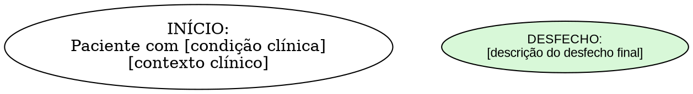
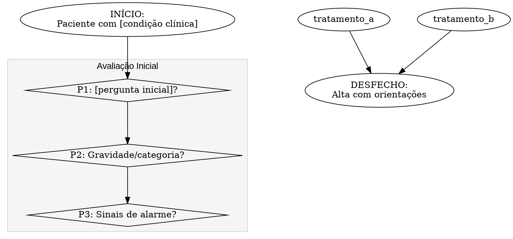

# Prompt Canônico para Transformação de Protocolos Médicos em Fluxogramas DOT

## Objetivo
Transformar protocolos médicos textuais em fluxogramas decisórios precisos e visualmente claros usando a linguagem DOT (Graphviz), mantendo a fidelidade ao protocolo original enquanto se otimiza a representação visual para máxima clareza e usabilidade.

## Princípios Fundamentais de Estruturação

1. **Sequência Lógica do Raciocínio Clínico**
   - Organize o fluxo em etapas sequenciais: Avaliação Inicial → Exame Físico → Diagnóstico → Exames → Tratamento → Encaminhamento
   - Cada decisão deve derivar logicamente da anterior, respeitando o processo clínico
   - Evite conexões que "pulem" etapas importantes do processo diagnóstico

2. **Agrupamento Visual por Função Clínica**
   - Utilize subgráficos (clusters) para agrupar elementos relacionados:
     ```dot
     subgraph cluster_avaliacao_inicial {
         label="Avaliação Inicial";
         style=filled;
         color=lightgrey;
         fillcolor="#f5f5f5";
         // Perguntas e decisões relacionadas à avaliação inicial
     }
     ```
   - Mantenha consistência visual entre grupos funcionais similares

3. **Hierarquia Clara de Decisões**
   - Posicione decisões críticas (como sinais de alarme) em destaque visual
   - Decisões que dependem de outras devem estar claramente subordinadas visualmente
   - Utilize alinhamento vertical para indicar hierarquia (decisões principais no topo)

4. **Padronização Visual de Elementos**
   - Decisões: losangos (shape=diamond)
   - Ações/Condutas: retângulos (shape=box)
   - Início/Fim: ovais (shape=oval)
   - Padrões de cores consistentes para categorias similares

5. **Conexões Precisamente Rotuladas**
   - Toda linha de conexão deve ter um rótulo claro (Sim/Não, valores específicos, categorias)
   - Para fluxos paralelos ou opcionais, use linhas tracejadas com cores distintas
   - Minimize cruzamentos de linhas usando técnicas como rank=same

## Configuração Técnica Base



## Sistema de Cores Funcional

1. **Código de cores por função:**
   - Azul claro (#ADD8E6): Início/fim do fluxograma
   - Creme (#FFF8DC): Decisões/perguntas normais
   - Rosa claro (#FFCCCC): Sinais de alarme ou decisões críticas
   - Lilás claro (#E6E6FA): Exames e orientações
   - Verde claro (#D8F8D8): Condutas padrão
   - Vermelho claro (#FFD8D8): Condutas urgentes/especiais

2. **Utilização consistente:**
   ```dot
   // Exemplo de decisão crítica
   p3 [label="P3: Possui sinais de alarme?\n• Febre >37,8ºC\n• Déficit neurológico\n• [outros sinais]", shape=diamond, fillcolor="#FFCCCC"];
   
   // Exemplo de conduta urgente
   conduta_urgente [label="CONDUTA URGENTE:\n• [descrição da conduta]\n• [medicações]\n• [monitoramento]", fillcolor="#FFD8D8"];
   ```

## Estruturas de Organização Avançadas

1. **Alinhamento de nós relacionados:**
   ```dot
   // Agrupar nós relacionados horizontalmente para reduzir cruzamentos
   { rank=same; p2; dor_leve; dor_moderada; dor_intensa; }
   { rank=same; p4; p5; }
   ```

2. **Fluxos paralelos e opcionais:**
   ```dot
   // Conexão tracejada para fluxos opcionais/paralelos
   p1 -> p9 [style=dashed, color=blue, label="Consideração paralela"];
   ```

3. **Subgráficos para agrupamento lógico:**
   ```dot
   subgraph cluster_exames {
       label="Exames Complementares";
       style=filled;
       color=lightgrey;
       fillcolor="#f5f5f5";
       
       // Nós relacionados a exames
       p6; p7; p8;
       lab; rx; tc_rm;
   }
   ```

## Processo de Transformação do Protocolo

### Fase 1: Análise e Decomposição
1. Identifique no protocolo original:
   - Pontos de decisão (perguntas com múltiplos desfechos possíveis)
   - Critérios objetivos para cada decisão
   - Condutas específicas para cada resultado decisório
   - Sequência lógica entre as etapas

2. Estruture hierarquicamente os componentes:
   - Decisões principais vs. secundárias
   - Processos que ocorrem em série vs. paralelo
   - Pontos de convergência onde fluxos separados se reúnem

### Fase 2: Criação do Esqueleto do Fluxograma
1. Estabeleça o fluxo principal de cima para baixo:
   ```dot
   inicio -> p1 -> p2 -> p3;
   ```

2. Defina os agrupamentos funcionais usando subgráficos:
   ```dot
   subgraph cluster_avaliacao_inicial { /* ... */ }
   subgraph cluster_exame_fisico { /* ... */ }
   subgraph cluster_tratamento { /* ... */ }
   ```

3. Implemente as decisões principais com suas conexões primárias:
   ```dot
   p2 -> tratamento_a [label="Categoria A"];
   p2 -> tratamento_b [label="Categoria B"];
   p2 -> tratamento_c [label="Categoria C"];
   ```

### Fase 3: Implementação Detalhada
1. Adicione conteúdo específico a cada nó:
   ```dot
   p3 [label="P3: Possui sinais de alarme?\n• Febre >37,8ºC\n• Perda de peso inexplicada\n• Déficit neurológico\n• [outros critérios]"];
   
   tratamento_b [label="CONDUTA B:\n• Medicação X 500mg 8/8h\n• Monitorar parâmetro Y\n• Reavaliação em 24h"];
   ```

2. Implemente fluxos secundários e paralelos:
   ```dot
   // Conexões para terapias físicas (secundárias à avaliação principal)
   p1 -> p9 [style=dashed, color=blue, label="Se localização específica"];
   ```

3. Garanta que todos os caminhos convergem para desfechos apropriados:
   ```dot
   tratamento_a -> alta;
   tratamento_b -> alta;
   consulta_especializada -> alta;
   ```

### Fase 4: Otimização Visual
1. Minimize cruzamentos usando alinhamentos estratégicos:
   ```dot
   { rank=same; p2; tratamento_a; tratamento_b; tratamento_c; }
   ```

2. Ajuste espaçamento para áreas complexas:
   ```dot
   // Aumentar espaço entre clusters complexos
   ranksep=1.2;
   ```

3. Verifique e ajuste rótulos de conexão para máxima clareza:
   ```dot
   p14 -> consulta_especializada [label="TC alterada"];
   p14 -> p13 [label="TC normal"];
   ```

## Checklist de Verificação Final

✓ **Fidelidade ao protocolo original**
- [ ] Todas as decisões do protocolo estão representadas
- [ ] Critérios decisórios mantêm fidelidade ao original
- [ ] Condutas e medicações conforme especificado no protocolo

✓ **Clareza visual e organização**
- [ ] Fluxo principal claro e intuitivo
- [ ] Agrupamentos funcionais visualmente distintos
- [ ] Mínimo de cruzamentos de linhas
- [ ] Código de cores consistente e significativo

✓ **Completude lógica**
- [ ] Cada decisão tem saídas para todos os resultados possíveis
- [ ] Nenhum "beco sem saída" no fluxograma
- [ ] Todos os caminhos convergem para desfechos apropriados

✓ **Precisão técnica**
- [ ] Critérios decisórios são objetivos e verificáveis
- [ ] Condutas medicamentosas completamente detalhadas
- [ ] Exames e encaminhamentos claramente especificados

✓ **Otimizações específicas**
- [ ] Decisões críticas (sinais de alarme) visualmente destacadas
- [ ] Fluxos paralelos adequadamente indicados
- [ ] Conexões todas rotuladas apropriadamente

## Execução Prática

1. Implemente o código DOT começando pela estrutura geral e configurações
2. Adicione os nós de decisão e conduta em ordem lógica
3. Implemente as conexões principais seguindo o fluxo clínico natural
4. Adicione subgráficos para agrupamento visual
5. Implemente fluxos secundários e paralelos
6. Otimize visualmente usando rank e ajustes de espaçamento
7. Verifique contra o checklist final

## Exemplo de Resultado Final (Fragmento)

