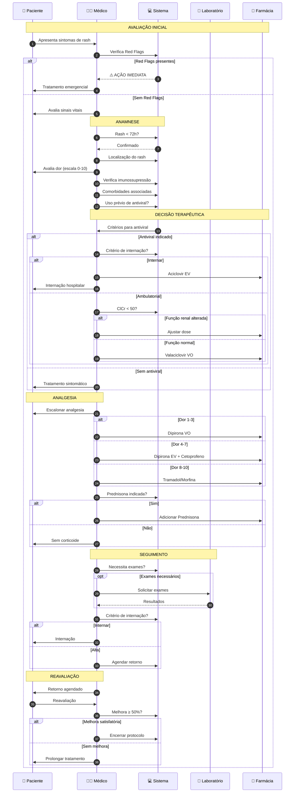

# Protocolo Herpes Zoster - Sequence Diagram (Linhas Retas)

---

## Vantagens do Sequence Diagram:
- ✅ **Linhas completamente retas** como na sua imagem
- ✅ **Layout organizado** em colunas
- ✅ **Fácil de seguir** o fluxo temporal
- ✅ **Mostra interações** entre diferentes participantes

## Comparação:
- **Flowchart**: Bom para mostrar decisões e caminhos alternativos
- **Sequence Diagram**: Perfeito para mostrar processo sequencial com linhas retas 